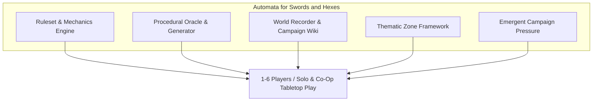
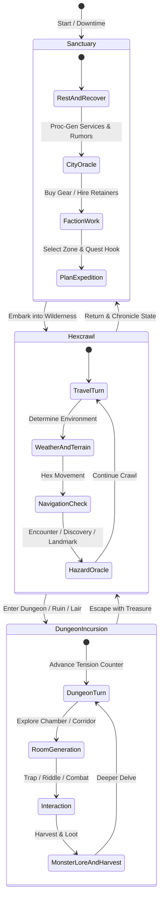

# Automata for Swords and Hexes (ASH RPG)

> **A modern evolution of 1st Edition Advanced Dungeons & Dragons, combining Old-School Renaissance grit, modular procedural worldcraft, and an automated GM-less tabletop engine.**

---

## ⚔️ Overview

**Automata for Swords and Hexes (ASH)** is a unified tabletop roleplaying framework, campaign chronicler, procedural generator, and digital assistant. Designed for **1 to 6 players**, ASH enables deep, tactical, and emergent old-school fantasy roleplaying **without requiring a dedicated Dungeon Master**. 

By blending the deep flavor and crunch of **1st Edition AD&D** with the streamlined elegance of modern OSR games (**Shadowdark**, **B/X**, **DCC**), ASH places world-building, rule adjudication, and procedural storytelling directly into the hands of the adventuring party.

---

## The next playable release: a companion for the physical table

ASH's immediate goal is a complete, repeatable expedition played by several people together in real life. One computer hosts the campaign; players use phones to view characters, choose activities, roll or record dice, and operate shared exploration. Conversation, fictional decisions, unusual rulings, and miniature positioning remain at the table.

The first release is complete when four players can join, create a Fighter, Thief, Priest, and Wizard, choose tavern activities, follow a generated lead, travel and camp, explore a dungeon, resolve combat, divide treasure, return home, and resume the saved campaign next session.

### Minimum playable scope

| Part | Release requirement |
| --- | --- |
| Shared table | QR joining, character ownership, live state, reconnect recovery, a nominated caller for shared actions, and correction of mistakes. The caller can also be a player; this role does not require a dedicated GM. |
| Four core classes | Fighter, Thief, Priest, and Wizard with usable equipment, class features, talents, and spells. Validate levels 1–3 first; existing higher-level content remains outside this release's completion claim. |
| Mobile character sheet | HP, AC, conditions, inventory, spells, ability/skill checks, saves, attacks, and damage. Support app rolls and entered physical-dice results. |
| Tavern | Each player chooses recovery, rumor gathering, carousing, or buying supplies; costs and outcomes persist. The party selects a lead or its own objective. |
| Hex exploration | A shared party marker, legal travel, visible travel costs, time and supplies, encounters, discovery, and a return journey. |
| Camping | Each player selects a duty on their phone; the table resolves one shared camp with supplies, recovery, and possible interruption. |
| Adventure paths | Generate connected situations, leads, clues, sites, and consequences. Use The Mind Below as the first supported template, with reusable interfaces for other paths. |
| Sites and dungeons | Persistent site changes, connected rooms and exits, a shared current room, discovery, revisiting, and exploration turns. |
| Combat assistance | Monster generation, initiative, rounds and turns, PC and monster HP, conditions, death saves, reaction, and morale. |
| Treasure and return | Generate and claim treasure once, allocate items and gold, award XP, and preserve the expedition's discoveries and outcomes. |

### What exists and what remains

The current implementation provides campaign hosting and persistence, live phone synchronization, character statistics and progression, procedural hex travel, tavern leads, camping resolution, site entry, room generation, monster generation, and HP tracking. These are foundations, not a claim that the complete release flow has been verified.

The principal remaining work is playable class actions and spells, inventory and contextual rolls, persistent individual tavern/camp choices, shared-action coordination, a connected dungeon map, initiative, and treasure allocation. Dungeon generation currently produces chamber records rather than a traversable room graph. Existing path integration also needs reusable situation and outcome handling.

Build in four stages: **playable party → playable expedition → playable adventure → complete session**. Keep one party marker on each exploration map and use the rules' Close/Near/Far distances for table combat. Additional classes, individual tactical tokens, automatic monster turns, exhaustive spell automation, and additional path templates can follow the first complete session.

See the [engineering implementation plan](docs/plans/table_companion_mvp.md) for dependencies, data changes, milestones, and release acceptance. The [Table Companion guide](docs/table_companion.md) covers running the existing application. The broader pillars below describe the longer-term vision.

---

## 🌟 The Five Pillars of ASH



### 1. Unified Ruleset & Tabletop Engine
* **Modernized 1e DNA:** Retains the gritty, lethal, and wondrous atmosphere of 1st Edition AD&D while eliminating cumbersome charts in favor of streamlined, intuitive OSR mechanics.
* **Streamlined Resolution:** D20 roll-under or target-based checks, slot-based inventory, situational light and supply pressure, and high-stakes combat.
* **Danger & Resource Economy:** Exhaustion, ration depletion, ammunition tracking, spell mishaps, and real-time tension crawlers.
* **Morale & Reaction:** Automated 2d6 monster reaction checks, dynamic morale triggers, and distinct monster instincts rather than mindless combat-to-the-death.

### 2. Procedural Oracle & Generator
* **GM-less Adjudication:** Probability-driven oracle prompts, context-aware yes/and/no/but tables, hazard triggers, and surprise/encounter engines.
* **Settlement & City Generator:** Inspired by *Forgotten Realms Adventures*, generating detailed towns, garrisons, local laws, temple hierarchies, underworld networks, and tavern rumors.
* **Dungeon & Hex Builder:** On-the-fly generation of room layouts, dungeon dressings, traps, ecological encounters, and hidden caches.

### 3. Living World Recorder & Campaign Wiki
* **West Marches Style Log:** Automatic hex mapping, point-of-interest (POI) logging, faction standing, NPC relationship trees, and expedition debriefs.
* **Dynamic Chronicle:** Tracks calendar time, seasonal weather, discoveries, faction movement, and whichever campaign pressures actually emerge in play.
* **Codex & Bestiary:** Integrated rules reference, spell compendium, item glossary, and lore unlock engine.

### 4. Monsternomicon Ecology & Lore Engine
* **Lore Knowledge Rolls:** Inspired by Privateer Press' *Monsternomicon*, characters uncover progressive tiers of monster lore (Common Knowledge, Field Observations, Obscure Lore, and Arcane Secrets) based on skill and intelligence checks.
* **Harvesting & Anatomical Salvage:** Detailed harvesting tables for crafting potions, reagents, relics, and alchemical gear from fallen foes.
* **Adventure Hooks:** Every beast and entity comes pre-loaded with organic hooks, lair rumors, and regional ecosystem impacts.

### 5. Thematic Zone Framework & Emergent Campaign Structure
* **Cursed Scroll / MMO-Themed Zones:** Self-contained, highly flavored regional zones (reminiscent of Shadowdark's *Cursed Scroll* zines and iconic thematic lands like Northrend, The Crossroads, or Un'Goro Crater). Each zone features bespoke weather matrices, wandering tables, unique flora/fauna, environmental hazards, and faction tensions.
* **Fiction-Shaped Campaign Motion:** Campaigns can remain open frontiers or develop into pursuits, rival races, faction struggles, spreading crises, mysteries, closing opportunities, escalation ladders, known deadlines, or multi-act epics.
* **Optional Pressure Tracks:** Add a track only when something can change without waiting for the party. A campaign can use none, one, or several, and reaching the final step changes the situation rather than ending play.
* **Optional Act Structure:** Three-act progression remains available for epic campaigns, but acts change when the fiction enters a new phase rather than at mandatory level thresholds.

---

## 🧭 Design Inspirations & Influences

| Source | Core Concept Borrowed / Adapted |
| :--- | :--- |
| **AD&D 1st Edition / OSRIC** | Gritty tone, spell variety, high lethality, classic class archetypes, and deep treasure tables. |
| **Shadowdark RPG** | Dangerous darkness, clean d20 resolution, slot-based inventory, minimalist stat blocks, and quick-rolling tables. |
| **Dungeon Crawl Classics (DCC)** | Mighty deeds of arms, volatile spell casting, critical hit & fumble tables, and weird fantasy flavor. |
| **Forgotten Realms Adventures (1e/2e)** | Comprehensive city generation templates, guild structures, local magistrates, and urban adventuring tables. |
| **Monsternomicon (Privateer Press)** | Monster lore DCs, harvesting rules, behavioral tactics, and adventure hooks per creature. |
| **Night Below & Out of the Abyss** | Multi-tiered, 3-Act campaign arcs with rising stakes, pacing guidelines, and environmental dread. |
| **Cursed Scroll Zines** | Distinct thematic mini-settings, customized zone-specific encounter tables, and tight geographic sandboxes. |
| **Hexcrawl & West Marches** | Player-driven exploration, persistent cartography, emergent storytelling, and decentralized campaign play. |

---

## 🎲 Core Play Loops



---

## 📁 Repository Structure & Organization

```
ash-rpg/
├── docs/                     # Design documentation, system manifestos, and references
│   ├── rules/                # Core mechanics, combat, exploration, and character creation
│   ├── bestiary/             # Monster entries with lore DCs, harvesting, and tactics
│   ├── magic/                # Spell lists, rituals, mishaps, and relic catalog
│   └── oracles/              # Tables for settlements, dungeons, weather, and encounters
├── zones/                    # Thematic zone modules (Cursed Scroll style mini-settings)
│   ├── ashplains_of_mor/     # Example: High-volatility volcanic wilderness
│   └── drowned_fens/         # Example: Submerged crypts and sunken ruins
├── campaigns/                # Campaign modules and optional arc structures
│   └── deep_abyss/           # 3-Act overarching campaign framework
├── wiki/                     # Lore codex, faction rosters, and dynamic campaign recorder
└── src/                      # Digital companion & assistant codebase (Engine, CLI/UI)
```

---

## 🚀 Getting Started

### 🎲 Run the Table Companion

The repository now includes a local multiplayer campaign app for a shared screen and player phones. It stores each campaign in SQLite, synchronizes play live, and automates the ASH oracle, wilderness, dungeon, encounter, lore, and threat procedures.

```bash
npm install
npm run dev
```

Open `http://localhost:3000`, create a campaign, and let players scan the join QR code from the Frontier screen. See the [Table Companion guide](docs/table_companion.md) for the implemented scope, architecture, backup location, and production run commands.

### 📖 Accessing the Player's Handbook & Campaign Wiki
The full **Player's Handbook**, **Campaign Record**, **Procedural Oracles**, and **Monsternomicon** are available as an interactive searchable wiki:

* **Live GitHub Pages Wiki:** [`https://kostchei.github.io/ash-rpg/`](https://kostchei.github.io/ash-rpg/)

#### Local Development & Preview
To run the documentation site locally with live reload:
```bash
# Install dependencies
pip install mkdocs-material pymdown-extensions

# Launch local server
mkdocs serve
```
Open `http://127.0.0.1:8000/` in your browser.

---

## 🎲 Starting a Campaign

1. **Review the Rules:** Read the core rules in [`docs/rules/`](file:///d:/Code/ash-rpg/docs/rules/) or the [Live Rules Wiki](https://kostchei.github.io/ash-rpg/rules/01_system_overview/).
2. **Session Zero & World Seeding:** Follow the [Player-First Demographic Engine](file:///d:/Code/ash-rpg/docs/rules/03_player_first_worldbuilding/) to place Cultural Enclaves on the [19-Hex Atlas](file:///d:/Code/ash-rpg/docs/campaign_record/hex_atlas_19/).
3. **Assemble the Party:** Roll 1–6 characters and log them in the [Party Roster](file:///d:/Code/ash-rpg/docs/campaign_record/party_roster/).
4. **Launch an Expedition:** Track your turns, log your hexes, consult the procedural oracles, and log your journey in the [Session Logs](file:///d:/Code/ash-rpg/docs/campaign_record/session_logs/).

---

## 📜 License & Acknowledgments

* Designed for open-table and GM-less OSR gaming.
* Built under compatible Open Game License (OGL) / Creative Commons guidelines for old-school compatible systems.
