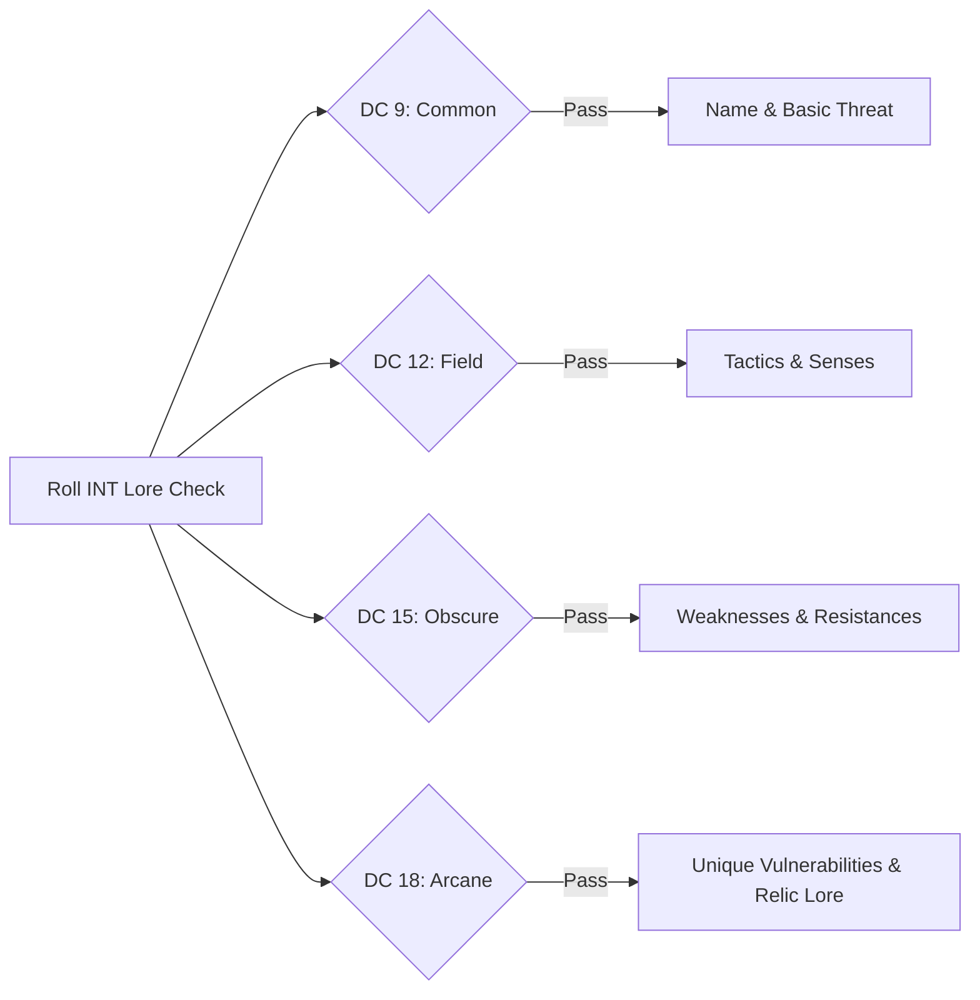

# Monsternomicon: Lore DCs & Harvesting Rules

> **"To face a monster without knowledge is suicide. To study its biology, sever its glands, and harvest its venom is true mastery."**

Inspired by Privateer Press's legendary *Monsternomicon*, ASH elevates monsters from mere sacks of Hit Points into rich ecological puzzles with progressive lore tiers and deep crafting utility.

---

## 📚 The 4-Tier Lore Knowledge System

When encountering an unknown creature, any character may make an **Intelligence (Lore) Check** (or rely on Sage class features):

| Lore Tier | Intelligence DC | Knowledge Uncovered |
| :--- | :---: | :--- |
| **Tier 1: Common Knowledge** | **DC 9** | Creature name, general danger level, common habitat, and folk rumors. |
| **Tier 2: Field Observations** | **DC 12** | Combat instincts, pack behavior, vision/senses, and basic natural attacks. |
| **Tier 3: Obscure Lore** | **DC 15** | Damage immunities, elemental resistances, special breath/gaze weapons, and save modifiers. |
| **Tier 4: Arcane Secrets** | **DC 18+** | True weaknesses, unique harvesting harvest locations, historical origins, and relic synthesis. |

---

## 🧪 Anatomical Harvesting & Salvage Rules

Following a victorious encounter, characters with skinning knives, harvesting kits, or the Alchemist class may spend **1 Crawling Turn** to harvest parts from fallen foes:

* **Making the Check:** Roll **1d20 + DEX or INT modifier** (DC specified on creature harvesting table, typically DC 11 to 14).
* **Alchemist Advantage:** Alchemists make all harvesting checks with **Advantage**.
* **Results:**
  * **Success:** Reagent is cleanly extracted and preserved (recorded in the [Harvesting Ledger](../campaign_record/harvesting_ledger.md)).
  * **Failure:** Reagent is torn, tainted, or rendered inert.
  * **Natural 1 (Contamination):** The harvester is exposed to the creature's poison/acid/curse and must immediately make a saving throw against its effect!
