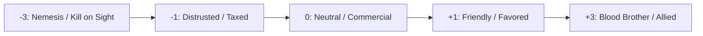

# Factions, Cultural Enclaves & NPC Standing

> **"In the borderlands, gold opens doors, but reputation keeps you alive when the blades come out."**

---

## 🏛️ Regional Cultural Enclaves

Cultural Enclaves seeded by character ancestries provide unique markets, services, and faction alliances:

| Enclave Name | Location | Associated Ancestry | Key NPC / Leader | Specialized Goods & Services |
| :--- | :---: | :--- | :--- | :--- |
| **Glimmercap Hollow** | Hex 02 | Forest Gnome | *Tinkerer Fizzlewick* | Minor illusion charms, smoke flasks, clockwork lockpicks |
| **Crag-Hold** | Hex 07 | Half-Ogre | *Commander Gorth* | Heavy siege weapons, giant-labor hirelings, boulder clearing |
| **The Drowned Shallows** | Hex 11 | Kuo-Toa | *High Shaper Skreeg* | Waterbreathing salves, harpoon spears, deep-sea pearls |
| **Dwarven Smelter Hold** | Hex 16 | Dwarf | *Master Forger Torvald* | Masterwork steel armor, heavy mining explosives, runes |

---

## ⚖️ Faction Reputation Matrix

Reputation scales from **-3 (Hated / Kill on Sight)** to **+3 (Exalted / Sworn Kin)**:

| Faction Name | Alignment / Focus | Standing (-3 to +3) | Recent Deed / Relationship Trigger |
| :--- | :--- | :---: | :--- |
| **The Ironbound Guard** | Lawful (Sanctuary Garrison) | **+1 (Friendly)** | Cleared goblin scouts from North Pine Pass |
| **The Silver Spire Archive** | Neutral (High Arcane Scholastics) | **0 (Neutral)** | Traded ancient parchment fragments |
| **The Whispering Shadow Guild** | Chaotic (Underground Syndicate) | **-1 (Distrusted)** | Vesper owes 150 gp in unpaid guild dues |
| **The Bloodtide Kuo-Toa** | Chaotic Neutral (Shoreline Cult) | **+1 (Friendly)** | Brought offerings to the Sea Shrine in Hex 11 |
| **The Obsidian Brood** | Chaotic Evil (Deep Underdark Cult) | **-2 (Hostile)** | Party intercepted their slave caravan |

---

## 📜 Lingering Debts & Nemesis Tracker

| Character | Creditor / Nemesis | Debt / Grievance | Complication Trigger |
| :--- | :--- | :--- | :--- |
| **Thokk** | *Kraven the Mind-Smith (Derro)* | Deed to clan iron mine stolen | Derro bounty hunters ambush on wandering rolls |
| **Vesper** | *Lady Malice of House Baenre* | Escaped with 2 doses of royal sleep venom | Drow poisoners tracking scent across surface hexes |
| **Elowen** | *Archmage Valerius* | Stole a forbidden page of illusion formulas | Arcane scrying orb follows party in wild hexes |
