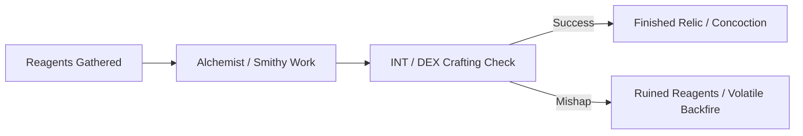

# Monsternomicon Harvesting & Reagent Ledger

> **"A slain beast is not merely an obstacle overcome—it is a reservoir of alchemical reagents, dragon scales, venom glands, and mystic bone."**

---

## 🧪 Stored Monster Parts & Reagents

| Reagent / Organ | Harvested From | Qty | Location / Carrier | Potential Crafting Recipe |
| :--- | :--- | :---: | :--- | :--- |
| **Giant Spider Venom Sac** | Giant Trapdoor Spider (Hex 05) | 2 | Vesper's Pack | Drow Sleep / Lethal Arrow Coating |
| **Bioluminescent Karst Spores** | Glowcap Fungus (Hex 06) | 4 | Elowen's Pouch | Cold-light Torch / Flash Bomb |
| **Manticore Tail Spike** | Manticore Corpse | 3 | Cart in Sanctuary | Masterwork Armor Piercing Darts |
| **Grave-Dust of the Barrow Wight** | Wight Crypt (Hex 04) | 1 vial | Sister Morwen | Unholy Ward Oil / Shadow Ward Draught |

---

## 🔨 Active Crafting & Forging Projects

| Project Name | Crafter / Artisan | Required Materials | Progress / Cost | Expected Output |
| :--- | :--- | :--- | :---: | :--- |
| **Viper-Tear Tincture** | Alchemist Fizwick (Hex 02) | 2 Venom Sacs + 15 gp solvent | 1 / 2 Days | 2 Vials of Fast-Acting Paralyzing Blade Oil |
| **Hardened Chitin Shield** | Torvald the Dwarf (Hex 16) | 4 Giant Beetle Shell Plates | 2 / 3 Days | +2 AC Shield (+1 bonus vs Acid) |
