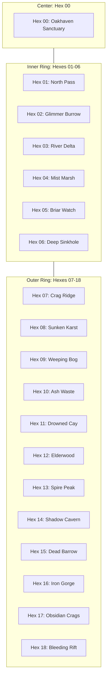

# The 19-Hex Regional Frontier Atlas

> **"Beyond the stockade walls of Hex 00 lies a wild, untamed expanse where ancient horrors slumber beneath forgotten barrows."**

---

## 🗺️ The 19-Hex Sandbox Map Diagram

The regional starting sandbox is organized as a **19-Hex concentric cluster**:
* **Hex 00 (Center):** The Sanctuary (Starting Town / Haven).
* **Hexes 01–06 (Inner Ring):** 1 Hex distance from Sanctuary (Immediate frontier & starting Enclaves).
* **Hexes 07–18 (Outer Ring):** 2 Hexes distance from Sanctuary (Deeper wilderness, ruins, and megadungeon entrances).

---

## 🧭 Hex Directory & Exploration Log

| Hex ID | Name / Region | Biome | Threat Tier | Key Landmark / POI | Exploration Status |
| :---: | :--- | :--- | :---: | :--- | :---: |
| **00** | **Oakhaven Sanctuary** | Fortified Basin | Tier 0 | High Watchtower, Temple of St. Jude, Tavern | **Fully Mapped** |
| **01** | **North Pine Pass** | Rocky Foothills | Tier 1 | Old Cobblestone Watchpost & Toll Bridge | Explored |
| **02** | **Glimmercap Hollow** | Enchanted Woods | Tier 1 | *Forest Gnome Enclave & Alchemical Market* | **Fully Mapped** |
| **03** | **Whispering Delta** | Reed Riverbanks | Tier 1 | Abandoned Fisher Skiffs & Sunken Idol | Explored |
| **04** | **The Mist Fen** | Stagnant Swamp | Tier 1 | Willow Tree Barrow with iron-bound door | Rumored |
| **05** | **Briar Crags** | Bramble Hills | Tier 1 | Goblin Clan Outpost & Spiked Barricade | Scouted |
| **06** | **The Great Sinkhole** | Subterranean Descent | Tier 2 | *Descent into the Underdark Karst System* | Discovered |
| **07** | **Crag-Hold** | Mountain Ridge | Tier 2 | *Half-Ogre & Giant Mercenary Trade Outpost* | Rumored |
| **08** | **Sunken Karst Deeps** | Karst Limestone | Tier 2 | Flooded Caverns & Bioluminescent Cave | Unexplored |
| **09** | **The Weeping Bog** | Toxic Mire | Tier 2 | Sunken Ziggurat of the Weeping Fish (Kuo-Toa) | Rumored |
| **10** | **The Ashen Waste** | Volcanic Ashfield | Tier 2 | Smoldering Fissure & Sulfur Pits | Unexplored |
| **11** | **The Drowned Shallows** | Coast / Delta | Tier 2 | *Kuo-Toa Shoreline Shrine & Pearl Traders* | Rumored |
| **12** | **Elderwood Primeval** | Ancient Forest | Tier 2 | The Heart-Oak Monolith & Sacred Druid Circle | Unexplored |
| **13** | **Spire of Astralis** | High Peak | Tier 3 | Ancient High Elf Observatory & Star Arch | Rumored |
| **14** | **The Shadow Cavern** | Abyssal Chasm | Tier 3 | Drow Shadow Outpost & Web Bridges | Unexplored |
| **15** | **The Dead Barrow Mound** | Desolate Moor | Tier 3 | Tomb of the First Warlord & Wight Crypt | Rumored |
| **16** | **Iron Gorge Foundry** | Canyon | Tier 2 | Orcish Iron Foundry & Smelter Works | Rumored |
| **17** | **Obsidian Crags** | Razor Rock | Tier 3 | Wyvern Roost & Dragon Glass Quarry | Unexplored |
| **18** | **The Bleeding Rift** | Planar Tear | Tier 3 | Eldritch Void Incursion & Floating Monoliths | Unexplored |
