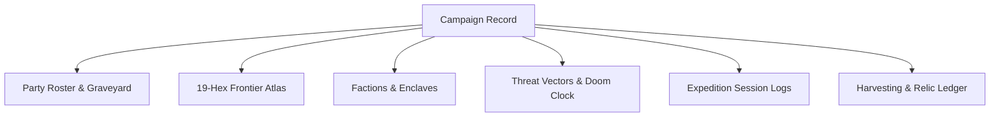

# Campaign Record: The Living World Chronicler

> **"A campaign is not merely a string of combats; it is a shared history etched in blood, discovery, mapped hexes, and the names of the fallen."**

---

## 🗺️ What is the Campaign Record?

The **Campaign Record** is the persistent memory of your **Automata for Swords and Hexes** campaign. Whether playing solo, 1-on-1, or with a full open-table West Marches group, this section serves as your live, interactive campaign binder.

---

## 🏛️ Modular Tracking Components

1. **[Party Roster & Graveyard](party_roster.md):**
   * Active heroes, stats, equipment slots, retainer statuses, and the *Graveyard of Honored Fallen*.
2. **[19-Hex Frontier Atlas](hex_atlas_19.md):**
   * The concentric 19-hex regional sandbox (Hex 00 Sanctuary through Outer Ring Hex 18), landmarks, hazard levels, and discovered routes.
3. **[Factions & Cultural Enclaves](factions_and_enclaves.md):**
   * Cultural outpost inventories, faction reputation standings ($-3$ Hostile to $+3$ Allied), and player character debt logs.
4. **[Threat Vectors & Doom Clocks](threat_vectors.md):**
   * The Quantum Nemesis tracker, clue milestones, omen counters, and 3-Act campaign escalation flags.
5. **[Expedition Session Logs](session_logs.md):**
   * Structured debrief templates capturing expedition turns, wandering encounters, loot secured, and downtime activities.
6. **[Harvesting & Crafting Ledger](harvesting_ledger.md):**
   * Monsternomicon anatomical salvage, preserved reagents, mutagenic extracts, and masterwork forging projects.

---

## 🛠️ How to Use This in Your Campaign

* **In GitHub / Markdown:** Edit these template files directly in your repository or via web pull requests after each session to maintain a permanent, version-controlled campaign history.
* **During Play:** Keep the [19-Hex Atlas](hex_atlas_19.md) and [Session Log](session_logs.md) open on a tablet or laptop to record discoveries as your party ventures across the frontier.
