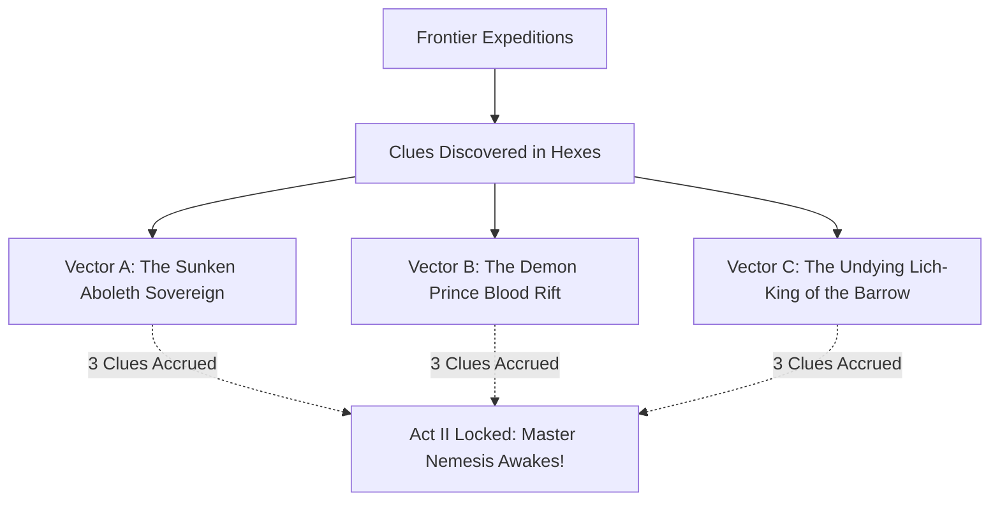
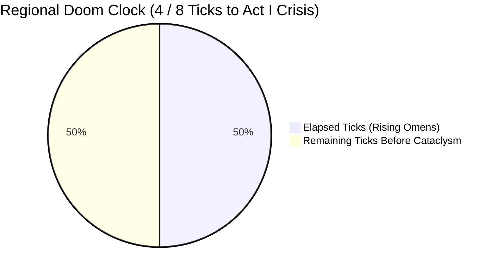

# Threat Vectors, Quantum Nemesis & Doom Clock

> **"The shadows do not wait for the heroes to be ready. With every tick of the doom clock, the sovereign stirs."**

---

## 👁️ The Quantum Nemesis Tracker (Act I: Levels 1–3)

In ASH’s GM-less engine, the true master villain of the 3-Act campaign emerges from player discovery during Act I. Three rival Cosmic Threat Vectors compete for dominion:

| Threat Vector | Cosmic Theme | Clues Discovered (0 / 3) | Known Omens & Manifestations |
| :--- | :--- | :---: | :--- |
| **Vector A: The Sunken Sovereign** | Primordial Aboleth / Psychic Sea | `[X] [ ] [ ]` (1/3) | Slime found on river fish; fishermen murmuring in unknown tongues in Hex 03 |
| **Vector B: The Blood Rift Incursion** | Demon Prince / Abyssal Fire | `[ ] [ ] [ ]` (0/3) | Red lightning storms over the northern peaks |
| **Vector C: The Undying Lich-King** | Ancient Necro-Empire / Wight Legion | `[X] [X] [ ]` (2/3) | Sarcophagi seals broken in Hex 04; ancient coin with crowned skull discovered |

* **Current Frontrunner:** **Vector C (2 Clues)** — The Undying Lich-King.

---

## ⏳ The Regional Doom Clock

The **Doom Clock** advances by **1 Tick** whenever:
* The party rests for a week of Downtime in Sanctuary.
* The party fails an objective or flees a dungeon boss.
* A major solar/astronomical conjunction occurs.

| Tick Level | State | Regional Manifestation / World Effect |
| :---: | :--- | :--- |
| **1–2** | Whispers & Disquiet | Minor vermin swarms; strange dreams among townsfolk. |
| **3–4** | Omens in the Wild | River water turns brackish; wild beasts become hyper-aggressive. *(Current State)* |
| **5–6** | Frontier Under Siege | Outpost caravans raided; dead rise in unhallowed cemeteries at midnight. |
| **7** | The Sovereign's Herald | High-tier boss champion arrives to demand the Sanctuary's surrender. |
| **8 (Crisis)** | **Act I Cataclysm!** | The Nemesis claims the regional keystone; Act II Mega-Delve begins! |
