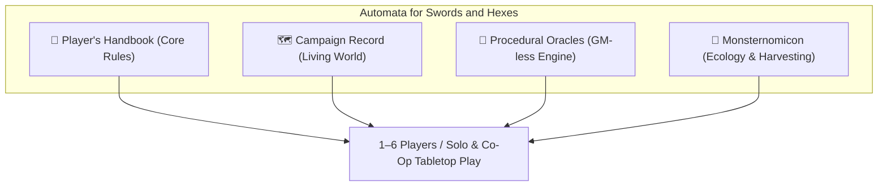

# Automata for Swords and Hexes (ASH RPG)

  
<em>A modern evolution of 1st Edition Advanced Dungeons & Dragons, combining Old-School Renaissance grit, modular procedural worldcraft, and an automated GM-less tabletop engine.</em>

---

## ⚔️ Welcome to the ASH Rules Codex & Campaign Chronicler

**Automata for Swords and Hexes (ASH)** is a unified tabletop roleplaying framework, procedural generator, and digital campaign assistant. Designed for **1 to 6 players**, ASH enables deep, tactical, and emergent old-school fantasy roleplaying **with or without a dedicated Dungeon Master**.

By blending the rich flavor and tactical depth of **1st Edition AD&D** with the streamlined elegance of modern OSR systems (**Shadowdark**, **B/X**, **DCC**), ASH places world-building, rule adjudication, and procedural storytelling directly into the hands of the adventuring party.

---

## 🧭 Navigating the Codex

-   :material-book-open-page-variant:{ .lg .middle } **[Player's Handbook](rules/01_system_overview.md)**

    ---

    Character creation, 17 ancestries, 8 core & specialist classes, equipment slots, dungeon crawl turns, situational light procedures, and spell tiers.

    [:octicons-arrow-right-24: Open Player's Handbook](rules/01_system_overview.md)

-   :material-map-legend:{ .lg .middle } **[Campaign Record](campaign_record/index.md)**

    ---

    West Marches style chronicler: 19-hex regional atlas, party roster, faction standing, cultural enclaves, optional campaign pressures, and session debriefs.

    [:octicons-arrow-right-24: Open Campaign Record](campaign_record/index.md)

-   :material-dice-d20:{ .lg .middle } **[Procedural Oracles](oracles/01_core_oracle.md)**

    ---

    GM-less adjudication tools: Likelihood rolls, settlement generator, dungeon architect, wilderness weather/hazards, and the 3-act narrative engine.

    [:octicons-arrow-right-24: Consult the Oracles](oracles/01_core_oracle.md)

-   :material-skull-scan:{ .lg .middle } **[Monsternomicon](bestiary/index.md)**

    ---

    Monster ecology with 4-tier Lore Knowledge DCs (Common, Field, Obscure, Arcane), tactical instincts, and anatomical harvesting tables.

    [:octicons-arrow-right-24: Open Monsternomicon](bestiary/index.md)

---

## 🌟 The Five Pillars of ASH

1. **Unified Ruleset & Tabletop Engine:** Roll-under ability checks, d20 target rolls, slot-based encumbrance, situational light and resource pressure, and high-lethality combat.
2. **Procedural Oracle & Generator:** Full GM-less resolution with context-aware oracle prompts, settlement generators, and dungeon dressings.
3. **Living World Recorder & Campaign Wiki:** Automatic hex mapping, POI logging, faction reputation, and dynamic campaign chronicles.
4. **Monsternomicon Ecology & Lore Engine:** Progressive lore unlock DCs and detailed harvesting tables for alchemical crafting from fallen beasts.
5. **Thematic Zone Framework & Emergent Campaign Structure:** Self-contained regional modules with optional pursuit, rivalry, faction, crisis, mystery, deadline, or multi-act progression.

---

!!! tip "Quick Keyboard Shortcuts"
    * Press <kbd>s</kbd> or <kbd>/</kbd> anywhere on this site to open the **Instant Rules Search**.
    * Press <kbd>p</kbd> and <kbd>n</kbd> to navigate to the **Previous** and **Next** chapters.
