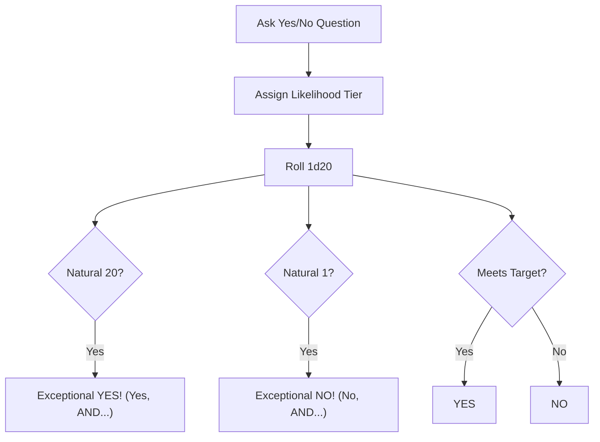

# The Core GM-less Oracle & Event Focus

> **"When the party stands at a crossroad and no referee speaks, consult the Oracle to unravel the tapestry of fate."**

---

## 🔮 The Binary Oracle (d20 Likelihood Check)

When players ask an environmental or narrative question (e.g., *"Is the iron portcullis rusted open?"*, *"Does the merchant know about the subterranean sinkhole?"*), determine the likelihood and roll **1d20**:

| Likelihood | Target Roll on 1d20 |
| :--- | :---: |
| **Almost Certain** | 4+ |
| **Likely** | 7+ |
| **Even Odds (50/50)** | 11+ |
| **Unlikely** | 15+ |
| **Nearly Impossible** | 19+ |

* **The Modifier Rules:**
  * **Natural 20:** *Yes, AND...* (An exceptional, unexpected benefit occurs).
  * **Natural 1:** *No, AND...* (An extreme complication or hazard immediately triggers).
  * **Even vs. Odd on Success/Failure:**
    * Even number on failure = *No, BUT...* (Minor silver lining).
    * Odd number on success = *Yes, BUT...* (Minor cost or complication).

---

## 🎲 Event Focus Generator (1d10)

When an unexpected twist, omen, or random event triggers, roll **1d10** to establish the focus:

| 1d10 | Event Focus | Description |
| :---: | :--- | :--- |
| **1** | **Remote Event** | Something happens out in the wild or back at Sanctuary that impacts the party. |
| **2** | **NPC Action** | A known NPC acts independently to advance their agenda or call for help. |
| **3** | **Introduce New NPC** | A stranger, bounty hunter, travelling peddler, or wandering pilgrim arrives. |
| **4** | **Advance Threat Vector** | A clue, minion, or omen related to the 3-Act Arch-Nemesis manifests. |
| **5** | **Resource Peril** | Water, rations, torches, or weapons suffer damage or depletion. |
| **6** | **Environmental Shift** | Sudden fog, torrential downpour, cave tremor, or toxic gas seep. |
| **7** | **Faction Incursion** | A patrol or raiding party from a regional faction crosses paths with the party. |
| **8** | **Ancient Discovery** | Runic inscription, lost skeleton, or forgotten treasure cache found. |
| **9** | **Physical Hazard** | Pitfall, falling stalactite, loose scree, or poison dart tripwire. |
| **10** | **Fortunate Boon** | Healing spring, friendly beast, shortcut passage, or dropped satchel. |

---

## 📜 Action & Theme Descriptor Tables (d100)

Roll **1d100** on both columns to generate evocative keywords for dreams, riddles, NPC rumors, and arcane visions:

| d100 | Action Verb | Thematic Noun |
| :---: | :--- | :--- |
| **01–10** | Uncover / Seize | Ancient Oath / Forgotten Blood |
| **11–20** | Betray / Guard | Subterranean Relic / Slumbering Beast |
| **21–30** | Transform / Purge | Corrupting Mire / Celestial Halo |
| **31–40** | Summon / Bind | Deep Karst / Runic Inscription |
| **41–50** | Desecrate / Restore | Crowned Skull / Sunken Ziggurat |
| **51–60** | Hunt / Flee | Toxic Spore / Shadow Syndicate |
| **61–70** | Bargain / Slay | Planar Rift / Broken Iron |
| **71–80** | Infiltrate / Breach | Webbed Chasm / Secret Seal |
| **81–90** | Protect / Enslave | Smoldering Fissure / Dead Empire |
| **91–00** | Awaken / Banish | Void Sovereign / Primordial Flame |
