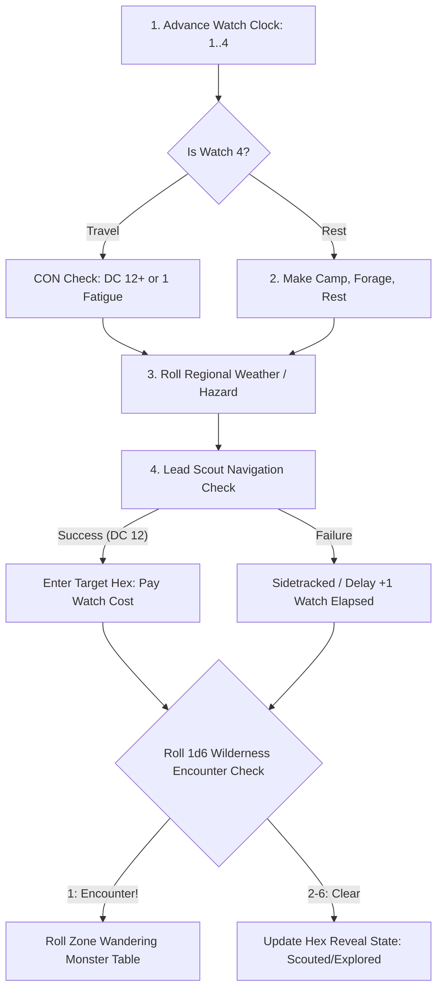

# Wilderness & Hex Travel Engine

> **"Crossing a wild hex is an act of navigation, endurance, and fortune. The wilderness does not forgive unprepared travelers."**

---

## 🧭 The 4-Watch Day (Hexcrawl Guidebook Engine)

In accordance with the **Hexcrawl Guidebook** (Desktop.json p. 11), a campaign day in ASH comprises four 6-hour watches:

| Watch | Time of Day | Primary Activity | Rules & Constraints |
| :---: | :--- | :--- | :--- |
| **Watch 1** | **Morning** (06:00–12:00) | Travel / Exploration | Standard travel conditions; lead scout navigates. |
| **Watch 2** | **Afternoon** (12:00–18:00) | Travel / Exploration | Peak daylight; heat or storm effects apply. |
| **Watch 3** | **Evening** (18:00–24:00) | Travel / Camp Setup | Twilight travel; camp defense and watch duties. |
| **Watch 4** | **Night** (00:00–06:00) | Camp / Long Rest | Standard rest watch. Resting here clears 1 fatigue level. |

### Forced March Rules
A party can spend up to **3 watches traveling per day** without penalty.
If the party travels during **Watch 4 (Night)** instead of resting:
- Every traveling character must make a **Constitution check** (DC 12 + 1 per consecutive forced watch).
- On failure: gain **1 Level of Fatigue** (disadvantage on checks and attacks until rested) and consume double rations/water.

---

## 🗺️ Hex Movement Costs (6-Mile Regional Hexes)

Movement watches required to traverse one 6-mile hex:

| Terrain / Route Category | Watch Cost | Examples |
| :--- | :---: | :--- |
| **Paved Highroad / Canal / Open Trail** | **1 Watch** | Paved roads, stone causeways, calm canal gondolas, well-trodden trails. |
| **Standard Off-Road Terrain** | **2 Watches** | Open woodlands, rolling grasslands, heath, fallow meadows, coastal scrub. |
| **Difficult Wilderness Terrain** | **3 Watches** | Dense peat bogs, mountain crags, jagged red dunes, tropical jungle, karst cavern siphons. |
| **Unbridged River / Chasm Crossing** | **+1 Watch** | Fording swift currents or descending ravines without bridge, ferry, or flight. |

---

## 🧭 Travel Watch Procedure

---

## 🌦️ Regional Weather Matrix (2d6)

Roll **2d6** at dawn each travel day:

| 2d6 | Weather Conditions | Mechanical Impact on Play |
| :---: | :--- | :--- |
| **2** | **Cataclysmic Storm / Gale** | Travel impossible; torches cannot stay lit outdoors; 1 fatigue level if caught unsheltered. |
| **3–4** | **Heavy Rain / Dense Fog** | Disadvantage on Navigation checks; ranged attacks beyond Near are impossible. |
| **5–8** | **Overcast / Mild Breeze** | Standard travel conditions; normal foraging. |
| **9–10** | **Clear Skies & Bright Sun** | Low-light penalties negated; Underdark folk suffer light sensitivity. |
| **11** | **Unnatural Heat / Aridity** | Double water ration consumption for the day or suffer exhaustion. |
| **12** | **Planar Aurora / Omen Sky** | Arcane spell checks gain +1 bonus; all 2d6 reaction rolls rolled with Advantage. |

---

## 🌲 Zone Wandering Monster Tables

Each of the 6 Cursed Scroll zones and frontier settings features curated wandering monster tables linked to the active zone profile:

1. **The Gloaming (CS1)**: Bittermold, Bogthorn, Dralech, Hexling, Howler, Ichor Ooze, Marrow Fiend, Skrell.
2. **The Red Sands (CS2)**: Camel (Silver), Canyon Ape, Dunefiend, Dust Devil, Mirage, Ras-Godai, Scrag, Siruul.
3. **The Isles of Andrik (CS3)**: Drake (Lesser), Drake (Greater), Draugr, Dverg, Nord, Sea Nymph, Sea Serpent, Werebear.
4. **The Black River (CS4)**: Giant Anaconda, Giant Ant, Basilisk Cultists, Basilisk Hatchling, Blue Dart Frog, Giant Catfish, Dire Condor, Jaguar King.
5. **Morzomotha & Karst Deeps (CS5)**: Bezelak, Dremir, Librarian of Leng, Nuln, Morzo-Moth, Wendel, Cave Creeper, Troglodyte.
6. **The City of Masks (CS6)**: Duelist, Roustabout, Bard, Necromancer, Assassin, Thief, City Guard, Wererat.
7. **Oakhaven Borderlands (Core)**: Wolf, Bandit, Giant Spider, Owlbear, Goblin, Orc, Barrow Wight, Skeleton.
