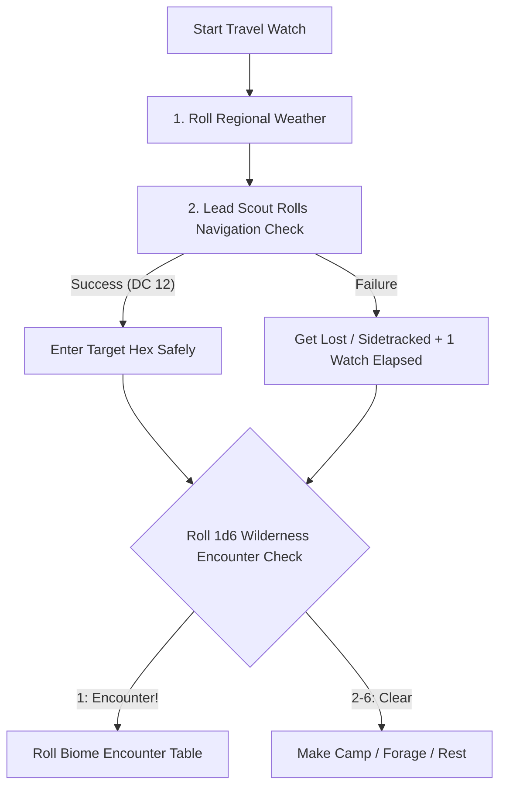

# Wilderness & Hex Travel Engine

> **"Crossing a wild hex is an act of navigation, endurance, and fortune. The wilderness does not forgive unprepared travelers."**

---

## 🧭 Wilderness Travel Procedure

Wilderness travel is executed in **Travel Watches** (each day has 3 Watches: Morning, Afternoon, Night):

---

## 🌦️ Regional Weather Matrix (2d6)

Roll **2d6** at dawn each travel day:

| 2d6 | Weather Conditions | Mechanical Impact on Play |
| :---: | :--- | :--- |
| **2** | **Cataclysmic Storm / Gale** | Travel impossible; torches cannot stay lit outdoors; 1 fatigue level if caught unsheltered. |
| **3–4** | **Heavy Rain / Dense Fog** | Disadvantage on Navigation checks; ranged attacks beyond Near are impossible. |
| **5–8** | **Overcast / Mild Breeze** | Standard travel conditions; normal foraging. |
| **9–10** | **Clear Skies & Bright Sun** | Low-light penalties negated; Underdark folk suffer light sensitivity. |
| **11** | **Unnatural Heat / Aridity** | Double water ration consumption for the day or suffer exhaustion. |
| **12** | **Planar Aurora / Omen Sky** | Arcane spell checks gain +1 bonus; all 2d6 reaction rolls rolled with Advantage. |

---

## 🌲 Biome Encounter Tables (1d8)

=== "Temperate Forests & Woodlands"

    | 1d8 | Encounter | Number Appearing | Initial Instinct / Motivation |
    | :---: | :--- | :---: | :--- |
    | **1** | Dire Wolves | 1d4+1 | Circling the party to pick off the rear scout. |
    | **2** | Goblin Snipers | 2d4 | Hidden in tree canopy with poisoned blowdarts. |
    | **3** | Forest Giant Spider | 1d2 | Web snare strung across the trail ahead. |
    | **4** | Wood Elf Rangers | 1d4+2 | Challenging trespassers; demanding regional toll. |
    | **5** | Wild Boar | 1 | Guarding wounded mate in thick bramble. |
    | **6** | Traveling Tinker Cart | 1d3 NPCs | Willing to barter rations and small supplies. |
    | **7** | Wandering Owlbear | 1 | Territorial display; roaring to drive party off. |
    | **8** | Ancient Treant Guardian | 1 | Slumbering near ancient runestone shrine. |

=== "Mires, Marshes & Fens"

    | 1d8 | Encounter | Number Appearing | Initial Instinct / Motivation |
    | :---: | :--- | :---: | :--- |
    | **1** | Giant Leech Swarm | 1 swarm | Hidden in knee-deep murky water. |
    | **2** | Lizardman Foragers | 1d6+1 | Hunting giant turtles; wary of dry-land folk. |
    | **3** | Will-o'-the-Wisp | 1 | Flickering pale light attempting to lure party into deep quagmire. |
    | **4** | Kuo-Toa Outcast | 1d2 | Babbling prayers to newly carved driftwood idol. |
    | **5** | Crocodile Behemoth | 1 | Submerged log ambush in muddy crossing. |
    | **6** | Sunken Skeleton Wardens | 2d4 | Rising from submerged clay barrows. |
    | **7** | Bog Hag | 1 | Stirring iron cauldron on stilt-hut; offers dark bargains. |
    | **8** | Hydra (Juvenile 4-Heads) | 1 | Gorging on dead elk in reed-bank. |

=== "Rocky Foothills & Mountain Crags"

    | 1d8 | Encounter | Number Appearing | Initial Instinct / Motivation |
    | :---: | :--- | :---: | :--- |
    | **1** | Mountain Lion / Cougar | 1 | Stalking from high rock ledge. |
    | **2** | Orc Raiding Scout Band | 1d6+2 | Tracking caravan tracks with war dogs. |
    | **3** | Harpy Flock | 1d4 | Singing from windswept cliff face. |
    | **4** | Half-Ogre Mercenaries | 1d2+1 | Returning from mercenary contract; willing to trade. |
    | **5** | Rockslide / Scree Hazard | Hazard | DC 12 DEX check or take 2d6 bludgeoning damage. |
    | **6** | Manticore | 1 | Perched on crag surveying prey below. |
    | **7** | Dwarven Prospectors | 1d4+1 | Testing quartz vein; offers sturdy iron nails/picks. |
    | **8** | Young Stone Giant | 1 | Contemplating ancient carved mountain relief. |
