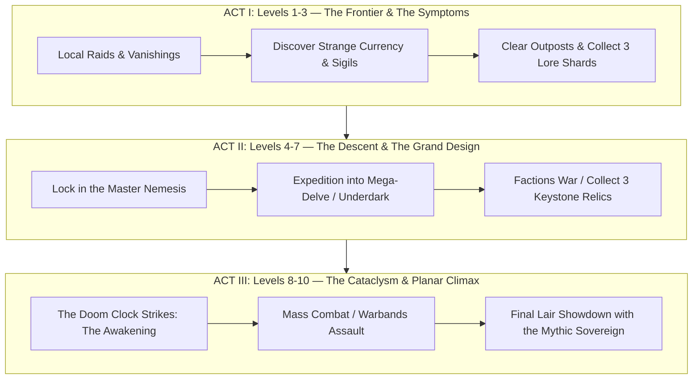
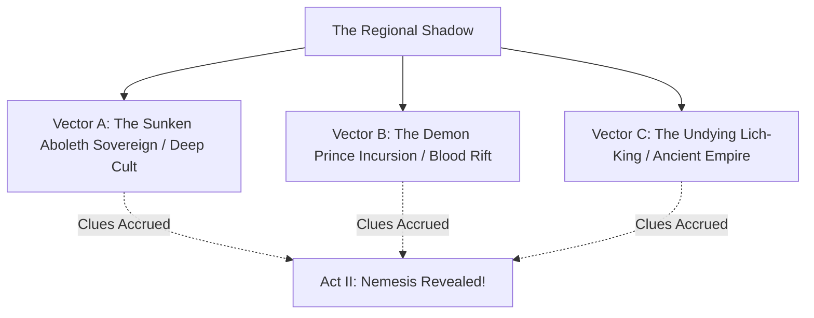

# The Emergent 10-Level Campaign & Procedural Hex Engine

> **"How do you tell an epic, coherent story across 10 levels on a tabletop when there is no Dungeon Master to orchestrate the plot and keep the secrets?"**

---

## 🧭 The Core Dilemma

In traditional RPG campaigns (like *Night Below* or *Out of the Abyss*), a Dungeon Master holds the campaign binder, knows the villains' hidden plots, places the clues, and stages the dramatic reveals across 10 levels.

In a **GM-less / Co-Op Tabletop Engine**, two fatal failure states typically occur if not designed carefully:
1. **The "Procedural Soup" (Zero Cohesion):** Everything is rolled on disconnected random tables. The party fights random skeletons in Hex 1, a random manticore in Hex 2, and a random cultist in Hex 3. The world feels like an incoherent grab-bag with no foreshadowing, stakes, or narrative momentum.
2. **The "Spoiler Problem" (Zero Mystery):** If the adventure is pre-written in a book, someone has to read the text, instantly spoiling the traps, villain identities, and twists.

**ASH solves both problems using the Emergent Threat Vector & Quantum Nemesis Engine.**

---

## 🏛️ The 3-Act Campaign Architecture (Levels 1–10)

Instead of pre-scripting *who* the villain is, ASH scripts the **Structural Anatomy of the Conflict across 3 Acts**:

---

## 👁️ The "Quantum Arch-Nemesis" Engine (Who is the Big Bad?)

At the start of Level 1, **nobody at the table knows who the Big Bad is**.

Instead, the campaign starts with **Three Competing Cosmic Threats (Threat Vectors)** lurking in the shadows of the region:

### The Clue Accrual Engine
1. Whenever the party clears a dungeon boss, investigates an ancient landmark, or captures an enemy lieutenant:
   * Roll **1d6** on the **Threat Manifestation Oracle**.
   * Award **1 Lore Shard / Clue** to the indicated Threat Vector on the [Threat Vector Tracker](../campaign_record/threat_vectors.md).
2. **The Lock-In Trigger:**
   * The first Threat Vector to reach **3 Lore Shards** becomes the **Confirmed Master Arch-Nemesis** for Acts II and III.
   * The other two vectors become either subservient cults, desperate allies against the greater evil, or secondary factions crushed in the sovereign's wake.

---

## ⏳ Transitioning Acts

### Act I $\rightarrow$ Act II: The Cataclysmic Descent (Level 4)
* The Master Nemesis's grand design is revealed.
* The starting town is attacked or threatened with annihilation.
* The party leaves the surface sandbox to embark on the **Great Descent** into the megadungeon or Underdark karst.

### Act II $\rightarrow$ Act III: The Sovereign Awakening (Level 8)
* The party gathers the 3 Keystone Relics.
* The Regional Doom Clock strikes 8.
* The Mythic Sovereign emerges in physical form, warping regional reality and demanding the final climactic confrontation!
