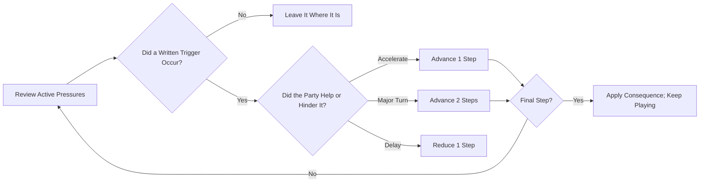

# Emergent Campaign & Escalation Toolkit

> **"A coherent campaign needs consequences and recurrence. It does not always need a villain, a deadline, or three acts."**

---

## 🧭 The GM-less Campaign Problem

Procedural play can become disconnected when every result vanishes after one scene. A prewritten plot creates the opposite problem: someone must know the answers and steer everyone toward them.

ASH creates continuity by recording what has entered the fiction and letting those forces move according to public procedures. The party may discover a mastermind, but it may just as easily become trapped in a chase, compete with a rival expedition, navigate faction politics, contain a spreading blight, or explore a frontier with no campaign-wide crisis at all.

The campaign record supplies memory. **Campaign Pressure** supplies motion only when motion is needed.

---

## 🧩 Choose the Campaign's Shape

Do not choose a structure before the premise needs one. Use the lightest shape that fits what the players are doing.

| Campaign Shape       | Recurring Question                                             | Useful Pressure                                             |
| :------------------- | :------------------------------------------------------------- | :---------------------------------------------------------- |
| **Open Frontier**    | What lies beyond the next known hex?                           | None until a faction or danger begins moving                |
| **Expedition Chain** | What will the party risk to return with knowledge or treasure? | Resource squeeze, rival race, or opportunity window         |
| **Chase / Escape**   | Can the party keep its lead or intercept the quarry?           | Pursuit distance with gains and losses                      |
| **Rivalry**          | Who reaches influence, territory, or the objective first?      | Rival milestones rather than elapsed time                   |
| **Faction Drama**    | Whose trust changes and who responds?                          | Heat, reputation, and escalation ladders                    |
| **Spreading Crisis** | Where does the danger move next and what can contain it?       | Geographic or population spread                             |
| **Mystery**          | Which explanation survives the evidence?                       | Revelation milestones; optionally Quantum Nemesis           |
| **Known Deadline**   | What can be accomplished before a fixed event?                 | Countdown—the classic Doom Clock case                       |
| **Epic Arc**         | How do local consequences grow into regional change?           | Several pressures that resolve and are replaced across acts |

These shapes can change. Resolving a pursuit might open a faction campaign. Winning a rival race might reveal a mystery. An open frontier might remain open for its entire life.

---

## ⚙️ Creating a Campaign Pressure

Create a track only when the answer to this question is **yes**:

> Is a person, group, condition, or opportunity capable of changing the situation without waiting for the party?

If yes:

1. **Name the moving force.** “The cult” is vague; “The Salt Choir recruits among the ferrymen” can act.
2. **Choose its shape.** Pursuit, rival race, faction heat, spreading crisis, revelation, opportunity window, escalation ladder, or countdown.
3. **Give it 4–8 steps.** Use fewer for immediate scene pressure and more for a slow campaign movement.
4. **Write 2–4 triggers.** Triggers are observable fictional events, not generic table time.
5. **Write the final consequence.** It must alter the situation without dictating the party's response.
6. **Decide visibility.** Public tracks support informed strategy. A hidden detail can be revealed by the Oracle when needed, but the procedure itself should remain public.

Record the result on the [Campaign Pressure page](../campaign_record/threat_vectors.md).

---

## 🎲 Moving the World Without a DM

Check relevant pressures after a scene, travel watch, or session:

When context does not clearly decide whether a force acts, ask the Binary Oracle. When an unexpected event says **Advance Threat Vector**, read it more broadly as **Move an Active Pressure**. Choose the most relevant track or roll among active tracks. If no pressure exists, reinterpret the result as an omen, faction action, or new opportunity; do not invent a catastrophe solely to fill a meter.

---

## 👁️ Optional Module: Quantum Nemesis

Use this module only when the campaign is deliberately about discovering an unknown coordinating power.

1. Write three plausible candidate explanations.
2. Do not decide which is true.
3. After a boss, ancient landmark, captured lieutenant, or other decisive discovery, associate one clue with the candidate most supported by context. Use the Oracle only if context is genuinely even.
4. The first candidate supported by three strong clues becomes the confirmed explanation.
5. Recast the other candidates as secondary factions, false interpretations, victims, or unrelated forces.

Quantum Nemesis is a **mystery/revelation technique**. It does not require the confirmed answer to become an Arch-Villain, cause a cataclysm, or force the campaign into a megadungeon.

---

## 🏛️ Optional Module: Three Acts

Three acts remain useful for a campaign seeking deliberate escalation, but their content follows the campaign's actual pressures:

| Act                            | Function                                                  | Possible Forms                                                                            |
| :----------------------------- | :-------------------------------------------------------- | :---------------------------------------------------------------------------------------- |
| **I — Establish**              | Learn the place, people, and moving forces                | Frontier expeditions, first pursuit, faction introductions, early evidence                |
| **II — Complicate**            | Earlier choices intersect and demand commitments          | Rival alliances, territory loss, deep expedition, public exposure, containment            |
| **III — Resolve or Transform** | Major pressures reach consequences and the region changes | Interception, peace, flight, cure, political settlement, siege, revelation, confrontation |

Level thresholds do not automatically change acts. Transition when the party's decisions and the state of the world create a genuine new phase.

---

## Examples Beyond a Doom Clock

### The Long Pursuit

The party stole a clan standard. The Ash Riders gain a pursuit step when the party fails navigation, leaves obvious camps, or lets a scout escape. Clever misdirection removes a step. At six steps, the Riders catch them—the result is an encounter and negotiation problem, not campaign failure.

### Race for the Fallen Star

The Red Cartographers gain milestones when they recruit an expert, secure a route, or recover a map fragment. The party can steal their lead, cooperate, sabotage them, or abandon the race. Reaching four milestones means the Cartographers arrive first and fortify the site.

### The Quiet Blight

The blight spreads when infected water moves downstream or a contaminated survivor enters a new settlement. It recedes when a source is cleansed or a community quarantines successfully. Each filled step names an affected hex rather than counting anonymous time.

### No Global Pressure

The company maps the frontier, takes contracts, and follows character anchors. Factions react locally and the session log preserves continuity. Nothing needs to threaten the entire region. Add a pressure later only if play creates one.
