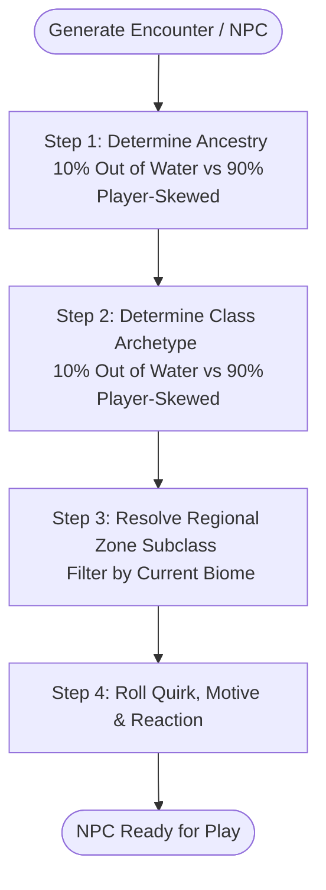
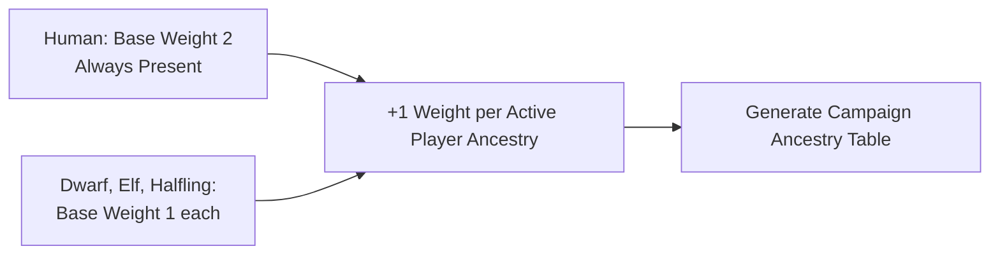
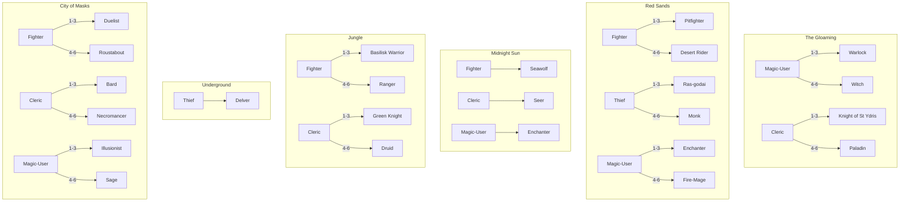

# NPC & Demographics Engine

> **"The world echoes the adventurers who dare walk it. A fellowship of sorcerers breathes arcane secrets into every hamlet, while a cadre of mercenaries summons a land of iron and blood."**

In **Automata for Swords and Hexes (ASH)**, the population of NPCs, hirelings, wandering rivals, and townfolk is **procedurally seeded by the active player party**. Both **Ancestry** and **Class** demographics skew based on player choices, while each biome introduces distinct regional variants and a 10% chance of encountering exotic "Fish Out of Water" travelers from far-off realms.

---

## 🧭 Full NPC Generation Flowchart

---

# Part I: Ancestry Demographics

Humanity forms the adaptable backbone of civilization across the frontier—**there are always humans**. However, the ancestries chosen by the players actively expand and skew the local population.

---

## 🎲 Ancestry Step 1: The 10% "Fish Out of Water" Check

Whenever rolling an NPC's ancestry, roll **1d100** (or **1d10**):

| 1d100 | Result | Procedure |
| :---: | :--- | :--- |
| **01–10** | 🌊 **Fish Out of Water (10%)** | The NPC is a rare traveler, subterranean wanderer, or planar visitor from beyond. **Roll directly on the [Master Global Ancestry Table](#master-global-ancestry-table-10-wildcard) below.** |
| **11–00** | 🏛️ **Regional Native (90%)** | The NPC is part of the local demographic ecosystem. **Roll on the [Party-Skewed Ancestry Table](#ancestry-step-2-party-skewed-regional-ancestry-table) below.** |

---

## ⚖️ Ancestry Step 2: Party-Skewed Regional Ancestry Table

### The Dynamic Ancestry Formula

1. **Foundational Humans:** **Humans** always start with a **Base Weight of 2** (the ubiquitous majority).
2. **Core Common Peoples:** **Dwarves**, **High Elves**, and **Halflings** start with a **Base Weight of 1** each.
3. **Player Party Skew:** For each character in the active player party:
   * Add **+1 Weight** to their ancestry.
   * If a player plays a **Wild, Underdark, or Planar ancestry** (e.g., *Tiefling*, *Forest Gnome*, *Kuo-Toa*, *Orc*), that ancestry is unlocked and added to the regional demographic pool with **Weight = 1 per player character** (and places an enclave within 2 hexes as per [World Seeding](../rules/03_player_first_worldbuilding.md)).
4. Total the weights to determine the die size to roll.

### Pre-Calculated Party Ancestry Examples

=== "Mostly Human Party (3 Humans, 1 Dwarf)"

    * **Formula:** Human 2 (base) + 3 = 5; Dwarf 1 (base) + 1 = 2; High Elf 1; Halfling 1. (Total Weight = 9).

    | Roll (1d9) | Ancestry | Demographic Weight | Population Proportion |
    | :---: | :--- | :---: | :---: |
    | **1–5** | **Human** | 5 | ~56% (Dominant) |
    | **6–7** | **Dwarf** | 2 | ~22% |
    | **8** | **High Elf** | 1 | ~11% |
    | **9** | **Halfling** | 1 | ~11% |

=== "All-Human Party (4 Humans)"

    * **Formula:** Human 2 (base) + 4 = 6; Dwarf 1; High Elf 1; Halfling 1. (Total Weight = 9).

    | Roll (1d9) | Ancestry | Demographic Weight | Population Proportion |
    | :---: | :--- | :---: | :---: |
    | **1–6** | **Human** | 6 | ~67% (Heavy Majority) |
    | **7** | **Dwarf** | 1 | ~11% |
    | **8** | **High Elf** | 1 | ~11% |
    | **9** | **Halfling** | 1 | ~11% |

=== "Diverse Party (1 Human, 1 Dwarf, 1 Wood Elf, 1 Tiefling)"

    * **Formula:** Human 2 (base) + 1 = 3; Dwarf 1 (base) + 1 = 2; High Elf 1; Halfling 1; Wood Elf 1; Tiefling 1. (Total Weight = 9).

    | Roll (1d9) | Ancestry | Demographic Weight | Note |
    | :---: | :--- | :---: | :--- |
    | **1–3** | **Human** | 3 | Common baseline |
    | **4–5** | **Dwarf** | 2 | Common baseline + player |
    | **6** | **High Elf** | 1 | Common baseline |
    | **7** | **Halfling** | 1 | Common baseline |
    | **8** | **Wood Elf** | 1 | Unlocked by player! |
    | **9** | **Tiefling** | 1 | Unlocked by player! |

=== "Subterranean Expedition (1 Deep Gnome, 1 Drow, 1 Half-Ogre, 1 Human)"

    * **Formula:** Human 2 (base) + 1 = 3; Dwarf 1; High Elf 1; Halfling 1; Deep Gnome 1; Drow 1; Half-Ogre 1. (Total Weight = 9).

    | Roll (1d9) | Ancestry | Demographic Weight | Note |
    | :---: | :--- | :---: | :--- |
    | **1–3** | **Human** | 3 | Common baseline |
    | **4** | **Dwarf** | 1 | Common baseline |
    | **5** | **High Elf** | 1 | Common baseline |
    | **6** | **Halfling** | 1 | Common baseline |
    | **7** | **Deep Gnome** | 1 | Unlocked by player! |
    | **8** | **Drow** | 1 | Unlocked by player! |
    | **9** | **Half-Ogre** | 1 | Unlocked by player! |

*(For odd dice such as 1d9, roll a 1d10 and reroll on a 10, or roll dynamically in digital dice tools).*

---

## 🌍 Master Global Ancestry Table (10% Wildcard)

When rolled on **Ancestry Step 1 (01–10)**, roll **1d100** or **1d20** to determine the NPC's exotic ancestry from across all known and uncharted realms:

| 1d20 | 1d100 | Ancestry | Category | Primary Distinction |
| :---: | :---: | :--- | :--- | :--- |
| **1–3** | **01–15** | **Human** | Common | Adaptable wanderer from distant empires. |
| **4–5** | **16–25** | **Dwarf** | Common | Deep smelter-smith or exiled rune-carver. |
| **6–7** | **26–35** | **High Elf** | Common | Arcane diplomat or celestial star-watcher. |
| **8–9** | **36–45** | **Halfling** | Common | Riverboat trader, provisioner, or scout. |
| **10** | **46–52** | **Wood Elf** | Wild & Primal | Canopy stalker bearing sacred fey tattoos. |
| **11** | **53–59** | **Forest Gnome** | Wild & Primal | Illusionist trickster with woodland animal familiars. |
| **12** | **60–66** | **Lizardman** | Wild & Primal | Scaled marsh hunter armed with bone spears. |
| **13** | **67–73** | **Orc** | Wild & Primal | Scarred war-veteran bound by honor codes. |
| **14** | **74–78** | **Half-Ogre** | Wild & Primal | Behemoth shock trooper or heavy caravan hauler. |
| **15** | **79–83** | **Deep Gnome (Svirfneblin)** | Underdark | Silent gem-carver escaping deep abyss horrors. |
| **16** | **84–88** | **Drow** | Underdark | Cloaked shadow agent carrying hand-crossbows and poisons. |
| **17** | **89–92** | **Kuo-Toa** | Underdark | Fanatical amphibious pilgrim chanting bizarre liturgies. |
| **18** | **93–95** | **Derro** | Underdark | Erratic subterranean artisan muttering mechanical secrets. |
| **19** | **96–97** | **Quaggoth** | Underdark | Claws and shaggy fur; feral cavern mercenary. |
| **20** | **98** | **Myconid** | Underdark | Silent fungal emissary communicating via telepathic spores. |
| **—** | **99** | **Tiefling** | Planar | Horned infernal emissary wrapped in brimstone cloaks. |
| **—** | **00** | **Deva** | Planar | Radiant celestial traveler bearing a soft golden halo. |

---

# Part II: Class Demographics & Regional Subclasses

Once the NPC's ancestry is determined, generate their **Class** using the player-skewed class engine.

---

## 🎲 Class Step 1: The 10% "Fish Out of Water" Check

Roll **1d100** (or **1d10**):

| 1d100 | Result | Procedure |
| :---: | :--- | :--- |
| **01–10** | 🌊 **Fish Out of Water (10%)** | The NPC practices an exotic martial art, forgotten magic, or foreign doctrine. **Roll on the [Master Global Class Table](#master-global-class-table-out-of-water).** |
| **11–00** | 🏛️ **Regional Native (90%)** | The NPC follows local traditions. Proceed to **Class Step 2** and **Step 3**. |

---

## ⚖️ Class Step 2: The Player-Skewed Archetype Table

The presence of player characters of a given class increases the world's demographic weight for that archetype. However, the **four core archetypes** (**Fighter**, **Magic-User**, **Cleric**, **Thief**) are *always* represented.

### The Dynamic Class Formula

1. Every core archetype begins with a **Base Weight of 1**.
2. For each player character of that archetype present in the party, add **+1 Weight** to that class.
3. Total the weights to determine the die size to roll.

### Pre-Calculated Party Skew Examples

=== "All Magic-Users (1–4 Magic-Users)"

    | Roll (1d5) | Base Archetype | Demographic Weight |
    | :---: | :--- | :---: |
    | **1** | **Fighter** | 1 (Base) |
    | **2–3** | **Magic-User** | 2 (Skewed) |
    | **4** | **Cleric** | 1 (Base) |
    | **5** | **Thief** | 1 (Base) |

=== "2 Fighters, 1 Cleric, 1 Thief (No Magic-User)"

    | Roll (1d7) | Base Archetype | Demographic Weight |
    | :---: | :--- | :---: |
    | **1–2** | **Fighter** | 2 (Skewed) |
    | **3–4** | **Cleric** | 2 (Skewed) |
    | **5–6** | **Thief** | 2 (Skewed) |
    | **7** | **Magic-User** | 1 (Base) |

=== "Balanced 4-Class Party (1 Fighter, 1 MU, 1 Cleric, 1 Thief)"

    | Roll (1d8) | Base Archetype | Demographic Weight |
    | :---: | :--- | :---: |
    | **1–2** | **Fighter** | 2 |
    | **3–4** | **Magic-User** | 2 |
    | **5–6** | **Cleric** | 2 |
    | **7–8** | **Thief** | 2 |

=== "Martial Trio (3 Fighters, 1 Thief)"

    | Roll (1d8) | Base Archetype | Demographic Weight |
    | :---: | :--- | :---: |
    | **1–4** | **Fighter** | 4 (Base 1 + 3 Fighters) |
    | **5** | **Magic-User** | 1 (Base) |
    | **6** | **Cleric** | 1 (Base) |
    | **7–8** | **Thief** | 2 (Base 1 + 1 Thief) |

---

## 🗺️ Class Step 3: Regional Zone Subclass Resolution

Once the base archetype is rolled, consult the current **Zone / Biome** where the NPC is encountered. Roll **1d6** (or **1d2**) to determine their specific regional class:

### Zone 1: The Gloaming *(Agricultural Plains & Temperate Mistwood)*
* **Fighter:** Standard Core Fighter (Man-at-arms, Yeoman, Border Guard).
* **Magic-User (1d6):**
  * `1–3:` **Warlock** *(Pact-bound occultist bargaining with ancient fey or shadows)*.
  * `4–6:` **Witch** *(Hedge herbalist brewing banes, charms, and potion wards)*.
* **Cleric (1d6):**
  * `1–3:` **Knight of St Ydris** *(Anointed crusader sworn to the martial chivalry of the Martyr)*.
  * `4–6:` **Paladin** *(Zealous smiter defending pilgrim havens and sanctified borders)*.
* **Thief:** Standard Core Thief (Poacher, River-runner, Smuggler).

---

### Zone 2: Red Sands *(Sun-Baked Desert & Canyons / Badlands)*
* **Fighter (1d6):**
  * `1–3:` **Pitfighter** *(Gladiatorial brute skilled in dirty tricks, chain-fighting, and arena combat)*.
  * `4–6:` **Desert Rider** *(Mounted skirmisher master of camelback archery and dune-scouting)*.
* **Thief (1d6):**
  * `1–3:` **Ras-godai** *(Silent desert assassin adept at poison crafting and sand-camouflage)*.
  * `4–6:` **Monk** *(Ascetic martial artist channeling inner sun-ki and barefoot mastery)*.
* **Magic-User (1d6):**
  * `1–3:` **Enchanter** *(Mesmerist weaving mirages, thirst illusions, and heat glamours)*.
  * `4–6:` **Fire-Mage** *(Pyromancer commanding searing solar rays and flame jets)*.
* **Cleric:** Standard Core Cleric *(Solar Sun-Priest or Oasis Water-Keeper)*.

---

### Zone 3: Midnight Sun *(Glacial Fjords, Icy Tundras & Northern Aurora)*
* **Fighter:** **Seawolf** *(Shield-biting longship raider resistant to bitter frost)*.
* **Cleric:** **Seer** *(Bone-tossing augur channeling ancestor spirits and doom-prophecies)*.
* **Magic-User:** **Enchanter** *(Rune-carver and aurora-weaver commanding ice glamours)*.
* **Thief:** Standard Core Thief *(Pelt-hunter, Ice-scout, Cache-lifter)*.

---

### Zone 4: Jungle *(Steaming Canopy, Mangrove Deltas & Primeval Ziggurats)*
* **Fighter (1d6):**
  * `1–3:` **Basilisk Warrior** *(Heavy skirmisher wielding venom-coated blades and reptile hides)*.
  * `4–6:` **Ranger** *(Peerless survivalist, beast-tracker, and primeval bowman)*.
* **Cleric (1d6):**
  * `1–3:` **Green Knight** *(Verdant champion bound by primal oaths to sacred groves)*.
  * `4–6:` **Druid** *(Shapeshifting primal priest who speaks the tongue of apex beasts)*.
* **Magic-User:** Standard Core Magic-User *(Ritualist of forgotten ziggurat stars)*.
* **Thief:** Standard Core Thief *(Canopy climber, vine-runner, temple looter)*.

---

### Zone 5: Underground *(Karst Caverns, Sunless Chasms & Subterranean Depths)*
* **Thief:** **Delver** *(Underground spelunker, trap-sniffler, and narrow-crawl infiltrator)*.
* **Fighter:** Standard Core Fighter *(Tunnel-guard, Deep Halberdier, Shield-wall)*.
* **Cleric:** Standard Core Cleric *(Abyssal priest of stone, darkness, or bioluminescent fungi)*.
* **Magic-User:** Standard Core Magic-User *(Chasm geomancer or void scholar)*.

---

### Zone 6: City of Masks *(Canal Metropolis, Grand Theatres & Masked Aristocracy)*
* **Fighter (1d6):**
  * `1–3:` **Duelist** *(Rapier master, parry specialist, and honorable swaggerer)*.
  * `4–6:` **Roustabout** *(Tavern brawler, dockside muscle, and alleyway bruiser)*.
* **Cleric (1d6):**
  * `1–3:` **Bard** *(Lute-singing skald who inspires allies with spell-songs and historical verse)*.
  * `4–6:` **Necromancer** *(Shadow mortician commanding grave dust, ossuary rites, and skeleton thralls)*.
* **Magic-User (1d6):**
  * `1–3:` **Illusionist** *(Phantom-weaver projecting deceptive mirrors, false doors, and phantasms)*.
  * `4–6:` **Sage** *(Encyclopedic scholar of planar secrets, deciphering scrolls with ease)*.
* **Thief:** Standard Core Thief *(Guild cutpurse, roof-runner, masked cat burglar)*.

---

## 🌐 Master Global Class Table ("Out of Water")

When rolled on **Class Step 1 (01–10)**, roll **1d100** or **1d24** on this table to discover an exotic character from across the globe:

| 1d24 | 1d100 | Class Name | Archetype | Native Realm & Distinction |
| :---: | :---: | :--- | :--- | :--- |
| **1** | **01–04** | **Fighter (Core)** | Martial | Frontier veteran equipped in iron plate. |
| **2** | **05–08** | **Pitfighter** | Martial | Scarred veteran of the Red Sands fighting pits. |
| **3** | **09–12** | **Desert Rider** | Martial | Nomadic archer from the Great Dune Wastes. |
| **4** | **13–16** | **Seawolf** | Martial | Fur-cloaked raider of the Midnight Sun fjords. |
| **5** | **17–20** | **Basilisk Warrior** | Martial | Heavy reptile-clad hunter from primeval jungles. |
| **6** | **21–24** | **Ranger** | Martial/Wild | Frontier scout and expert tracker of monster dens. |
| **7** | **25–28** | **Duelist** | Martial/Agile | Rapier aristocrat from the City of Masks. |
| **8** | **29–32** | **Roustabout** | Martial/Rough | Canal-side pugilist and heavy enforcer. |
| **9** | **33–36** | **Thief (Core)** | Rogue | Shadowed cutpurse and trap-breaker. |
| **10** | **37–40** | **Ras-godai** | Rogue/Slayer | Masked desert assassin steeped in shadow-arts. |
| **11** | **41–44** | **Monk** | Rogue/Martial | Ascetic warrior fighting with bare fists and ki. |
| **12** | **45–48** | **Delver** | Rogue/Scout | Chasm-runner with lanterns and grappling hooks. |
| **13** | **49–52** | **Cleric (Priest)** | Divine | Anointed vessel of radiant miracles and maces. |
| **14** | **53–56** | **Knight of St Ydris** | Divine/Martial | Chivalric order defender of The Gloaming. |
| **15** | **57–60** | **Paladin** | Divine/Smite | Holy avenger purging unnatural abominations. |
| **16** | **61–64** | **Seer** | Divine/Fate | Northern fate-weaver tossing runic whalebones. |
| **17** | **65–68** | **Green Knight** | Divine/Primal | Heavy champion sworn to primeval deepwood spirits. |
| **18** | **69–72** | **Druid** | Divine/Wild | Shapeshifting wild warden of ancient forests. |
| **19** | **73–76** | **Bard** | Divine/Song | Glamour skald weaving spells through melodies. |
| **20** | **77–80** | **Necromancer** | Divine/Dark | Crypt-master animating bone thralls and spirits. |
| **21** | **81–84** | **Wizard / Magic-User** | Arcane | Scholarly arcanist carrying heavy spellbooks. |
| **22** | **85–88** | **Warlock** | Arcane/Pact | Gloaming occultist bound to fey and fiends. |
| **23** | **89–92** | **Witch** | Arcane/Hedge | Potion brewer casting hexes and protective wards. |
| **24** | **93–96** | **Enchanter** | Arcane/Mind | Weaver of heat mirages, phantasms, and charms. |
| **—** | **97–98** | **Fire-Mage** | Arcane/Pyro | Searing pyromancer from the sun-temples. |
| **—** | **99–00** | **Alchemist / Sage** | Specialist | Harvester of monster parts or encyclopedic lorekeeper. |

---

# Part III: NPC Dressing, Motives & Retainers

To bring the generated NPC to life instantly, roll on the following auxiliary tables:

### NPC Demeanor & Quirk (1d12)
| 1d12 | Demeanor | Distinctive Physical Quirk |
| :---: | :--- | :--- |
| **1** | Paranoid & Watchful | Constantly glances behind doors; fingers weapon hilt. |
| **2** | Boastful & Loud | Boasts of monster kills; wears a predator fang necklace. |
| **3** | Melancholic & Soft-spoken | Sighs deeply between words; gazes into candlelight. |
| **4** | Mercenary & Transactional | Counts coins while talking; assesses your gear value. |
| **5** | Zealous & Devout | Quotes holy proverbs; marks prayer symbols on armor. |
| **6** | Jovial & Inquisitive | Laughs heartily; buys the table a round of bitter ale. |
| **7** | Stoic & Laconic | Speaks only in 2–3 word sentences; unfazed by threats. |
| **8** | Shifty & Whispering | Speaks in hurried hushed tones; avoids direct eye contact. |
| **9** | Scholarly & Analytical | Inspects weird artifacts, monster scales, and runic carvings. |
| **10** | Proud & Chivalrous | Offers formal salutes; will not tolerate dishonor. |
| **11** | Superstitious | Spits over left shoulder; carries dried charms and garlic. |
| **12** | Weary & Battle-Hardened | Covered in burn scars; resting before their next contract. |

### NPC Immediate Agenda / Motive (1d12)
| 1d12 | Current Motivation | Potential Party Interaction |
| :---: | :--- | :--- |
| **1** | **Seeking Hire:** Looking to join an expedition as a retainer (Standard Daily Wage). | Available hireling. |
| **2** | **Hunting a Nemesis:** Tracking an outlaw, monster, or rival who fled into the wilds. | Shared bounty hunt. |
| **3** | **Escaping a Debt:** In hiding from a syndicate collector or bounty hunter. | Complication / bribe. |
| **4** | **Caravan Escort:** Guiding an exotic trade cart to the next frontier enclave. | Travel companions. |
| **5** | **Lost Heirloom:** Searching a nearby dungeon hex for a family relic. | Dungeon rumor / quest hook. |
| **6** | **Spiritual Pilgrimage:** Traveling to a holy shrine or megalith to lift a curse. | Blessing / ritual guide. |
| **7** | **Selling Rare Salvage:** Carrying monster reagents or ancient scrolls to market. | Exotic barter vendor. |
| **8** | **Undercover Informant:** Secretly spying for a regional faction or baron. | Deception / faction lore. |
| **9** | **Wounded Survivor:** Sole survivor of a wiped-out adventuring party. | Warns of deadly dungeon trap. |
| **10** | **Challenging Champions:** Seeking honorable single combat to prove their prowess. | Duel for renown / wager. |
| **11** | **Seeking Strange Reagents:** Needs 2 fresh monster venom glands or rare herbs. | Harvesting bounty offer. |
| **12** | **Carrying Dire Warning:** An invading warband or cataclysm is 2 days away. | Create or advance a relevant pursuit, countdown, or spreading-crisis pressure. |

---

## 🤝 Retainer & Hireling Statistics

When an NPC is recruited as a companion or retainer:

* **Level:** Equal to **1d3** (or party level minus 1d2, minimum Level 1).
* **Hit Points & Talents:** Use the base class entry from [Core Classes](../rules/05_classes_core.md) or [Specialist Classes](../rules/06_classes_specialist.md).
* **Morale Check (2d6):** Roll **2d6 + NPC Morale Modifier** (modified by highest party CHA modifier) when reduced to half HP or facing terrifying horrors.
  * `2–6:` **Flee / Break Formation**
  * `7–9:` **Defensive Fighting (Hold Ground)**
  * `10–12:` **Unyielding Valour (Advantage on next attack)**
* **Standard Daily Wage:**
  * *Untrained Torchbearer / Laborer:* 1 gp / day
  * *Trained Man-at-Arms / Delver / Raider:* 2–5 gp / day
  * *Specialist Caster (Priest, Mage, Sage, Alchemist):* 10–20 gp / day + 1 share of discovered salvage
