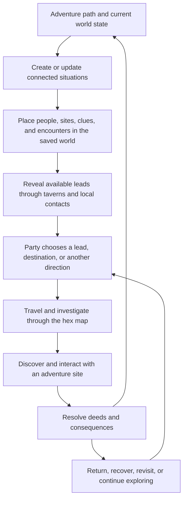

# Shared adventure-path and exploration process

Status: **agreed design direction; runtime integration remains to be implemented.**

The adventure path creates connected rumors, NPCs, encounters, and adventure sites. Taverns, travel through the hex map, and investigation of those sites let the party discover and affect them. The consequences of play change the saved world and create further opportunities.

This process applies across adventure paths. Each path retains its own world process, requirements, records, progression rules, and endings, as defined in [Adventure Path Engines](../oracles/07_adventure_path_engines.md). The current implementation gaps are recorded in the [hex-crawl gameplay review](hex_crawl_gameplay_review.md).

## 1. Responsibilities

| Part | Responsibility |
| --- | --- |
| Adventure path | Defines what is happening, who is involved, what they want, the evidence they leave, opportunities for intervention, and how outcomes change the campaign. |
| Regional world | Provides persistent geography, settlements, resources, habitats, and feasible connections where that content can exist. |
| Taverns and local contacts | Introduce rumors, witnesses, employers, services, and preparation opportunities that the party can currently learn about. |
| Hex exploration | Resolves the party's chosen travel, navigation, time, supplies, encounters, observation, and searches. |
| Adventure-site exploration | Resolves access, investigation, conversations, hazards, conflict, rewards, and lasting changes at a particular site. |
| Campaign record | Saves world truth, party knowledge, resolved deeds, and their consequences; supports return, revisit, and the next expedition. |

Path-related content coexists with ordinary regional people, places, and encounters. A campaign without a selected path can use the same exploration process. Follow each path's specific content-mixing requirements when a path is active.

## 2. The common loop

### Step 1 — Create a situation and its relationships

Given its current state, the path creates an eligible situation: someone moving captives, a disputed crossing, a missing witness, a threatened settlement, a concealed installation, or another authored opportunity.

Create the related NPCs, sites, encounter possibilities, evidence, and rumors as a connected set. Record who knows what, why each person is involved, what is actually present, and which outcomes matter to the path. A rumor's truth must be grounded in that set; a deliberate false or distorted claim needs a relationship to the underlying situation too.

This is a common content interface. Each path supplies its own logic behind it rather than requiring a separate tavern, map, and movement implementation.

### Step 2 — Place the content in the world

The path supplies placement needs; regional generation or placement finds physically suitable locations and routes. A drowned installation needs water and feasible access opportunities. A cave entrance needs a real passage. A caravan encounter needs a route it can use.

Save stable references linking the situation to its NPCs, sites, hexes/layers, and connections. Establish major geography and access needs early; less immediate detail can be materialized when needed and then persisted. Never replace an established location or identity just because the party visits it again.

### Step 3 — Make leads available

The saved tavern and its contacts reveal eligible information through conversation, a notice, an employer, a witness, or another appropriate interaction. Present multiple meaningful options with known directions, warnings, possible rewards, and preparation needs.

Hearing a rumor records the claim and its source in party knowledge. It does not automatically reveal the target's exact position, occupants, hidden connections, or the truth of the claim. The same lead can also be found through another suitable source when the authored path requires alternative clue routes.

### Step 4 — Let the party choose and travel

Players can follow a lead, choose a destination, explore another direction, prepare further, or remain in town. Selecting a lead records intent; it does not lock a route or automatically complete travel.

Resolve each travel watch from actual party position, geography, transport, weather, and saved progress. An eligible path encounter can occur alongside ordinary local events. Once introduced, its people and consequences persist. The party may investigate, avoid, negotiate, fight, wait, or retreat according to the situation.

### Step 5 — Reveal through observation and investigation

Arrival can reveal observable terrain and landmarks. Searching, following tracks, talking to people, and entering sites reveal additional eligible facts. A discovered entrance and a fully explored interior are different accomplishments.

Every revelation updates party knowledge of an existing entity or saved newly materialized detail. Encountering evidence may change a path's knowledge record where its rules say so; crossing into a hex does not automatically complete its situation.

### Step 6 — Resolve the situation and apply consequences

Record what the party actually did: freed a captive, accepted a bargain, damaged an installation, restored a bridge, recovered evidence, supported a faction, or left a problem unresolved.

The path evaluates those deeds under its own rules. Apply resulting changes to named people, sites, control, resources, routes, pressures, and future opportunities. Preserve each engine's distinct record and permanent Toll where applicable. Resolve consequences once, including across reconnects or repeated requests.

Time still advances through exploration. Path advancement uses the selected engine's explicit triggers, including calendar conditions or opportunity-based neglect where specified. There is no universal instruction to increase path progress every watch or every session.

### Step 7 — Continue in the changed world

Return journeys use the same travel procedure. Revisit the same tavern and sites, with their saved changes. Relevant contacts can react to events they could plausibly know about and offer new information; the journal retains what the party learned even when a rumor becomes outdated.

The party can continue, change its objective, or leave the path alone. The chosen engine determines how the world responds and which endings remain possible.

## 3. Shared records and visibility

Keep three things distinct:

- **World truth:** what exists, where it is, who controls it, its actual state, and its relationships to path situations.
- **Party knowledge:** claims heard, people met, routes observed, sites discovered, evidence found, and conclusions supported by play.
- **Path state:** hidden causes, fulfilled requirements, active operations, authored progress records, and available consequences/endings.

The common record links a path instance and situation to persistent NPC, rumor, encounter, site, and location references. It also records availability/discovery conditions and resolved deeds. Path-specific state remains an extension of this contract; it does not need to fit a single generic progress meter.

Player responses show the fiction and discovered information. Do not expose hidden path IDs, boss identities, internal insertion labels, unrevealed connections, or encounter budgets. Practical requirements the party knows about should remain legible: for example, the need for underwater breathing or a vessel.

## 4. Example: an opening expedition

Illustrative Mind Below situation, not an already generated campaign:

1. The path places a missing surveyor, a transport agent, and evidence of prisoner traffic at a disused waterworks connected to the region's river route.
2. A tavern contact knows the surveyor's last destination and reports nighttime wagons. Another contact offers unrelated work.
3. The party follows the waterworks lead, chooses an approach, and spends watches traveling. It may find wagon tracks or encounter a patrol with reasons to be on that route.
4. At the waterworks, observation reveals the building; investigation reveals the captives and an underground passage. Access to the passage is resolved physically.
5. Rescuing the surveyor changes that NPC's state, disrupts the operation, and supplies evidence about a second location. Those consequences follow the path's rules.
6. On return, the rescued surveyor can become a source of further information. The waterworks remains changed, and the path responds to the disrupted operation.

The path's hidden identity need never be announced for this sequence to work.

## 5. First implementation and acceptance

Implement one shared path-content interface and connect an initial Mind Below situation through the existing tavern, map, travel, discovery, and site systems. Reuse its implemented helpers where they agree with the authored rules. Persist its relationships and outcomes; do not build a parallel set of exploration controls.

Acceptance requires: hear a grounded lead, choose an approach, travel with costs and an interruptible encounter, discover and investigate the intended site, resolve a path-relevant deed, return, receive a justified follow-up, reload, and revisit the changed location. Also verify an unrelated lead, retreat, hidden-information filtering, and that repeated actions do not duplicate consequences. The same exploration interfaces must accept another path's content without embedding Mind Below-specific assumptions.

## 6. Deferred fix: Domains of Dread boundary loops

**User requirement recorded 2026-09-03; not yet implemented.** A Domains of Dread adventure path confines exploration to a finite domain. Traveling beyond its far edges loops the party back onto the same map from another direction. Walking outward cannot escape the domain or generate an unlimited frontier.

- Model this as a path-controlled world boundary rule, with saved links between outward boundary crossings and their re-entry locations/directions. The exact edge pairing remains an implementation detail; do not assume a simple opposite-edge rectangle for the hex map.
- Resolve the loop through normal travel, including time, applicable resource costs, encounters, arrival, and knowledge updates. Re-entry uses the existing saved world and preserves discoveries and site changes.
- Apply the rule at the actual domain boundary, not automatically at the edge of the current map view. Interior exploration and revealing further cells within the domain remain possible.
- Let players perceive and learn the looping geography through play without disclosing hidden path metadata or automatically revealing the re-entry area in advance.
- Ordinary boundary travel remains enclosed until the path's authored escape conditions open a real exit. Keep other adventure paths' boundary behavior independent.

Acceptance for the later fix: cross the domain boundary, re-enter the same saved map from the configured direction, pay the journey cost once, and retain that behavior after reload. Repeated outward travel must remain within the domain; a valid path-resolution exit must permit departure.
