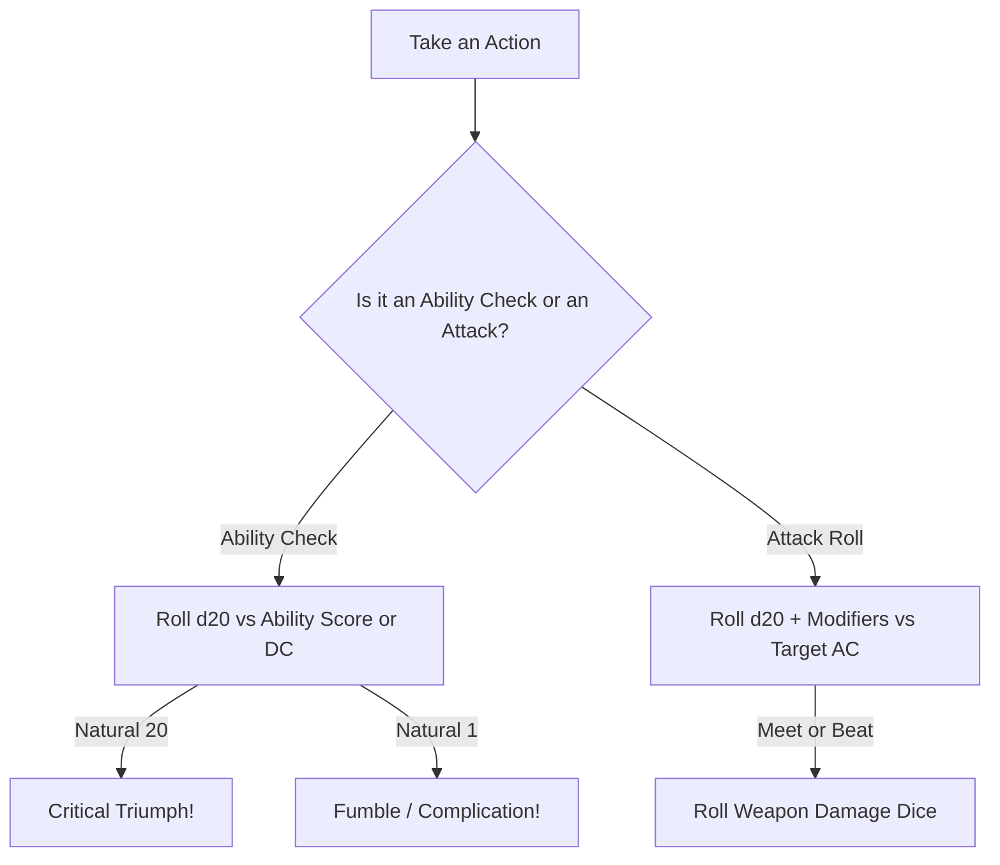

# System Overview & Core Resolution

> **"In the shadows of the unknown realm, steel meets sorcery, and every decision carries the weight of survival."**

Automata for Swords and Hexes (ASH) uses a unified, fast-flowing **d20 roll-under / target-based** system paired with a **2d6 reaction and talent engine**. The rules are designed to be fast at the table, highly lethal, and completely playable solo or as a co-op group without a Dungeon Master.

---

## 🎲 Core Dice Conventions

### 1. The D20 Test
Whenever a character attempts an action with a significant chance of failure or consequence:

* **Difficulty Class (DC):** The referee or oracle establishes a Difficulty Class:
  * **DC 9 (Easy):** Routine under pressure.
  * **DC 12 (Moderate):** Standard adventuring obstacle.
  * **DC 15 (Hard):** Dangerous feat requiring expertise.
  * **DC 18 (Very Hard):** Masterwork or heroic undertaking.
* **Rolling the Test:** Roll **1d20 + Ability Modifier**. If the total equals or exceeds the DC, the action succeeds.

### 2. Advantage & Disadvantage
* **Advantage:** Roll **2d20** and take the **higher** result. Awarded for superior positioning, prep work, clever tactics, or ancestry traits.
* **Disadvantage:** Roll **2d20** and take the **lower** result. Imposed by severe hindrances, magical blindness, exhaustion, or fighting in total darkness.
* *Rule of Cancellation:* Instances of Advantage and Disadvantage cancel each other out one-for-one.

### 3. Critical Rolls
* **Natural 20 (Critical Triumph):** Maximum damage + bonus damage die in combat, or extraordinary unintended benefit out of combat.
* **Natural 1 (Fumble / Catastrophe):** Immediate weapon drop, gear breakage, spell mishap, or immediate dungeon tension trigger.

---

## 📊 The Six Core Abilities

Characters possess six classic ability scores ranging from **3 to 18** (or higher with level-up talents):

| Ability | Abbr | Primary Use in ASH |
| :--- | :---: | :--- |
| **Strength** | **STR** | Melee attacks, brawn, breaking doors, athletic feats. |
| **Dexterity** | **DEX** | Ranged attacks, Armor Class modifier, stealth, reflex saves. |
| **Constitution** | **CON** | Hit Points per level, poison/disease saves, gear slot capacity. |
| **Intelligence** | **INT** | Arcane spellcasting, Monsternomicon lore checks, languages, ancient history. |
| **Wisdom** | **WIS** | Divine/Primal spellcasting, perception, tracking, willpower saves. |
| **Charisma** | **CHA** | Reaction rolls (2d6), retainer morale, NPC negotiations, dark glamour. |

### Ability Modifiers
Modifiers are calculated directly from ability scores:

| Ability Score | Modifier | Ability Score | Modifier |
| :---: | :---: | :---: | :---: |
| **3** | -4 | **12–13** | +1 |
| **4–5** | -3 | **14–15** | +2 |
| **6–8** | -2 | **16–17** | +3 |
| **9–11** | +0 | **18+** | +4 |

---

## ⚖️ The 2d6 Table System

ASH uses **2d6 rolls** for two crucial systems:
1. **Monster Reactions & Morale:** Unbiased, procedural determination of whether creatures attack, negotiate, or flee.
2. **Class Talents:** Rolled at odd levels (1, 3, 5, 7, 9) to advance class capabilities dynamically without decision paralysis.

---

## 🕯️ Situational Light & Crawl Time

Light becomes a tracked resource only when it creates a meaningful problem. Ignore light bookkeeping in daylight, within a settlement, beside a campfire, or while the party has a fueled lantern.

* **Active Darkness:** Start tracking light when the party moves away from stable light into night, underground passages, or supernatural darkness without a lantern or equivalent durable source.
* **Torches:** In active darkness, one torch lasts **6 Crawling Turns** (about 1 in-game hour). There is no real-world countdown.
* **Dungeon Crawling Turns (10 Minutes in-game):** In a dangerous dungeon, every search, lock attempt, or room investigation consumes 1 Crawling Turn. Every 2 turns, make an encounter/hazard check.

If darkness is not currently changing the party's choices, do not run a light timer.
