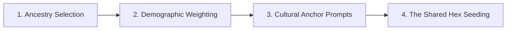

# Player-First World Building & Demographic Engine

> **"The world is not a static canvas painted before the heroes arrive; it is shaped by who steps up to wander its perilous hexes."**

In **Automata for Swords and Hexes (ASH)**, world-building is collaborative, procedural, and **player-driven**. Rather than a referee spending weeks creating a world the players may never explore, the party creates the world during **Session Zero** through their choice of **Ancestries**, **Classes**, and **Starting Anchors**.

---

## 🧭 The 4-Step World Seeding Procedure

---

### Step 1: Ancestry & Class Selection
Every player selects their character's **Ancestry** and **Class**. The combination of these choices acts as the algorithmic seed for the campaign's starting region, factions, and procedural encounter tables.

---

### Step 2: Demographic Weighting & Enclave Placement

The referee engine establishes the demographic makeup of the starting region based on the party's makeup:

1. **Dominant Regional Heritage:**
   * The ancestries chosen by the players represent the **Dominant and Active Peoples** of the starting frontier.
   * Unchosen ancestries become **Rare, Ancient, or Foreign visitors**.

2. **Automated Enclave Placement (2-Hex Rule):**
   * For **every unique ancestry** represented in the party, place **1 Enclave / Cultural Outpost** within **2 hexes** of the starting home base (The Sanctuary).
   * Each enclave provides bespoke trade goods, services, and faction hirelings associated with that culture.

3. **Encounter Table Bias:**
   * When rolling on wandering monster / encounter tables:
     * **Kindred Encounters:** If an encounter matches a party member's ancestry, apply a **+2 bonus to the 2d6 Reaction Roll** (representing cultural kinship, shared language, or mutual respect).
     * **Cultural Rivals:** If an encounter is with a historical rival ancestry (e.g., Drow vs. Deep Gnome, or Surface Elf vs. Orc), roll with **Disadvantage on initial reaction**, but award **Inspiration/Luck** if resolved through diplomacy or clever play.

4. **Biome & Environmental Seeding:**
   * **Subterranean Heritage (Drow, Deep Gnome, Kuo-Toa, Derro, Quaggoth, Myconid):** Seeds at least **one great subterranean descent / sinkhole hex** within 3 hexes of the Sanctuary.
   * **Primal & Marsh Heritage (Wood Elf, Forest Gnome, Lizardman):** Seeds dense primeval forest hexes, swamp waterways, and sacred megaliths.
   * **Planar Heritage (Tiefling, Deva):** Seeds a **Planar Bleed / Leyline Rift hex** where supernatural phenomena occur.

---

### Step 3: Cultural Anchor Prompts

During character creation, each player answers **three anchor prompts** for their character. These answers are recorded directly into the [Party Roster](../campaign_record/party_roster.md) and [Campaign Atlas](../campaign_record/hex_atlas_19.md):

| Anchor | Description | Example |
| :--- | :--- | :--- |
| **1. The Homeland Truth** | A distinct custom, sacred taboo, or architectural style of your people. | *"Myconids commune in silent psychic circles under moon-spore blooms; burning mushrooms is a capital offense."* |
| **2. The Local Landmark** | A ruined tower, sunken barrow, sacred grove, or mysterious monolith located out in the wild hexes. | *"The Sunken Ziggurat of the Weeping Fish, where ancient Kuo-Toa priests sang the waters to life."* |
| **3. The Lingering Debt / Nemesis** | A person, monster, rival guild, or debt collector searching for you or your clan. | *"A Derro mind-smith named Kraven who holds the deed to my clan's iron mine."* |

---

### Step 4: The Shared Hex Seeding (Session Zero Map)

1. Take a blank **19-Hex Region Map** (1 center hex + 2 concentric rings of hexes).
2. Place **The Sanctuary** (the starting town/haven) in Hex 00 (the Center).
3. In turn order, each player places their **Local Landmark** in an uncharted hex 1 to 3 hexes away from the Sanctuary.
4. The party collaboratively names the region (e.g., *The Ashen Vale*, *The Sunken Reaches*, *The Broken Marches*).
5. Roll **1 Regional Threat / Overarching Doom Clock** from the [3-Act Campaign Architect](../oracles/05_emergent_campaign_engine.md).

---

## ⚖️ Example: The 3-Player Regional Synthesis

**The Party:**
* Player 1: **Kuo-Toa Cleric**
* Player 2: **Half-Ogre Fighter**
* Player 3: **Forest Gnome Magic-User**

**The Resulting Emergent World:**
* **Demographics:** The starting frontier is a precarious borderland between a flooded lake basin, a deep underground karst system, and an enchanted elderwood.
* **Nearby Enclaves Placed:**
  * Hex 02 (1 hex North): *Glimmercap Hollow* (Forest Gnome burrow-market dealing in illusions and alchemical reagents).
  * Hex 07 (2 hexes South): *Crag-Hold* (Half-Ogre & Hill Giant mercenary trade post).
  * Hex 11 (2 hexes East): *The Drowned Shallows* (Kuo-Toa shoreline shrine trading pearls and rare deep-water fish).
* **Atmosphere:** Deeply magical, watery, and rugged—instantly unique and personalized to the players' characters.
