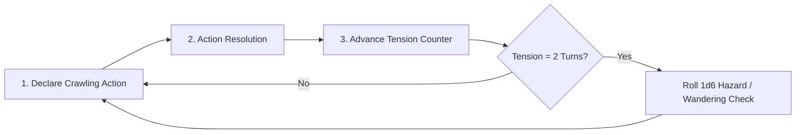

# Exploration & Dungeon Crawling Procedures

> **"In the subterranean depths, time is not measured in hours—it is measured in the flickering life of your torch and the mounting echoes of the dark."**

---

## ⏳ The Crawling Turn Engine

Exploration in ASH operates on **Crawling Turns**. In a dungeon or ruin, time is strictly tracked:

### Turn Actions (1 Crawling Turn = ~10 Minutes in-game)
Each turn, the party performs one major synchronized action:
* **Move & Map:** Advance to an adjacent dungeon room or unmapped corridor.
* **Search for Secrets / Traps:** Thoroughly inspect stone walls, chests, or sarcophagi.
* **Pick Lock / Force Door:** Attempt to open a barred or locked gateway.
* **Short Rest (Breather):** Bandage wounds and catch breath (regains 1d4 HP; requires safe room).

---

## 🕯️ Real-Time Light: The 1-Hour Torch Rule

ASH incorporates the high-tension **1-Hour Real-Time Light Rule**:

!!! danger "The Light Economy"
    * A **Torch** burns for **exactly 1 hour of real-world game time**.
    * Keep a visible countdown timer at the table or on your digital tracker.
    * When the timer hits 0:00, the light dies immediately.
    * In **Total Darkness**:
      * Characters without Infravision cannot see, navigate, or cast targeted spells.
      * Attack rolls are made with **Disadvantage**.
      * Enemies gain **Advantage** on all attacks against the party.
      * Wandering encounter checks are rolled **every single Crawling Turn**.

---

## ⚠️ Hazard & Wandering Checks

Every **2 Crawling Turns** (or immediately if the party makes excessive noise or breaks a door):
Roll **1d6 on the Dungeon Hazard Table**:

| 1d6 | Result | Effect |
| :---: | :--- | :--- |
| **1** | **Wandering Monster!** | Immediate encounter rolled on the dungeon's ecological table. |
| **2** | **Ominous Sign / Omen** | Sound of claws on stone, rising sulfur smoke, or a distant death cry. |
| **3** | **Environmental Hazard** | Cave-in tremor, toxic fungal spore burst, or flooding water. |
| **4** | **Resource Depletion** | Draft flickers a torch (lose 10 mins) or rations spoiled by dampness. |
| **5–6** | **Eerie Silence** | Clear for now. The darkness waits. |

---

## ⛺ Rests & Starvation

### Short Rest (1 Turn in Dungeon)
* Must be in a secured chamber (doors spiked shut).
* Consume 1 fresh water ration.
* Recover **1d4 HP** or restore 1 exhausted class talent.

### Long Rest (8 Hours in Sanctuary / Safe Enclave)
* Full recovery of all Hit Points and daily class abilities / spell slots.
* Requires 1 day of iron rations and a safe bed.
* In the wild, requires 2 party members on active watch rotation (roll 2 hazard checks overnight).

### Starvation & Dehydration
* Adventurers need **1 ration and water daily**.
* If a day passes without rations, gain **1 Level of Exhaustion** (Disadvantage on STR and CON checks; HP maximum reduced by 25%).
