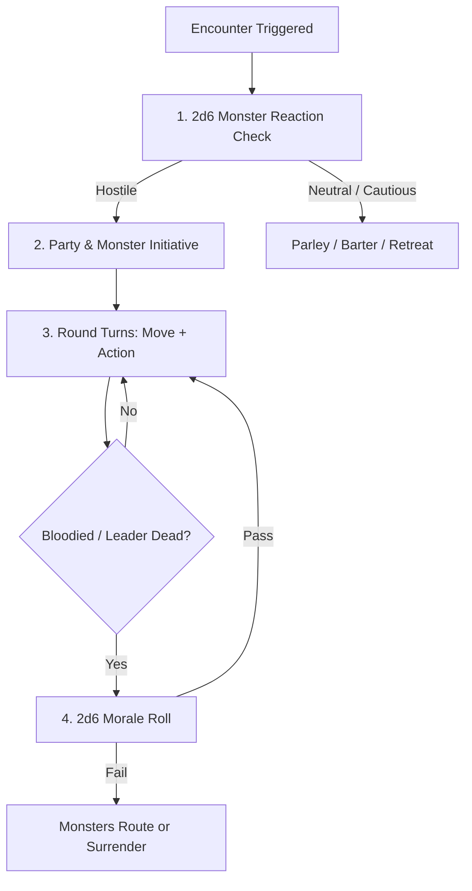

# Combat & Hazards

> **"Combat in ASH is fast, brutal, and consequential. Avoid fights when you can; win decisively when you must."**

---

## ⚔️ Combat Flow & Round Structure

Combat is played in structured **Combat Rounds** (each round represents ~6 seconds of intense action):

---

## 🎯 Distance & Zones

ASH uses intuitive spatial zones instead of rigid grid measurements:

| Range Zone | Distance | Typical Action |
| :--- | :--- | :--- |
| **Close** | Within 5 feet / Melee reach | Daggers, swords, unarmed strikes, grappling. |
| **Near** | Up to 30 feet / One move action | Thrown flasks, shortbows, movement across a chamber. |
| **Far** | Beyond 30 feet / Longbow range | Heavy crossbows, longbows, distant spells. |

---

## 🎲 2d6 Reaction & Morale Engines

### 1. Initial Encounter Reaction (2d6 + CHA Mod)
When an encounter begins and neither side has initiated an ambush:

| 2d6 Roll | Reaction | Behavior |
| :---: | :--- | :--- |
| **2–3** | **Hostile / Aggressive** | Attacks on sight; zero parley. |
| **4–6** | **Suspicious / Threatening** | Weapons drawn, demands tribute or withdrawal. |
| **7–9** | **Cautious / Neutral** | Willing to barter, trade rumors, or ignore party. |
| **10–11** | **Curious / Friendly** | Offers assistance, warnings, or trade opportunities. |
| **12+** | **Allied / Receptive** | Eager to cooperate, join as guides, or form a pact. |

### 2. Monster Morale Check (2d6 vs Monster Morale Score)
Monsters in ASH are living beings with self-preservation instincts. Roll **2d6** whenever:
* The first monster in a group is slain.
* The monster's Hit Points drop below 50% (Bloodied).
* The pack leader or boss is killed.

* **Result:** If the 2d6 roll **exceeds** the monster's Morale rating (typically 7 to 9), the creatures **rout, surrender, or scatter in panic**.

---

## 💥 Critical Hits & Fumbles

### Critical Hit (Natural 20)
* Deal **maximum weapon damage** + roll **one additional damage die**.
* Target must make a CON save or suffer a grievous wound (severed limb, stunned for 1 round, or knocked prone).

### Critical Fumble (Natural 1)
* Weapon drops to the floor or bowstring snaps.
* User grants Advantage to the next melee attack against them.

---

## ☠️ Death & Dying

When a character reaches **0 Hit Points**:
* They fall **Unconscious & Bleeding Out**.
* At the start of each of their turns, they make a **Death Saving Throw (DC 10 CON check)**:
  * **Success:** Stable (unconscious, regains 1 HP after 1 hour rest).
  * **Failure:** 1 Strike marked. At **3 Strikes**, the character is dead.
  * **Natural 20:** Immediately awakens with 1 HP!
  * **Natural 1:** Immediately marks 2 death strikes.
