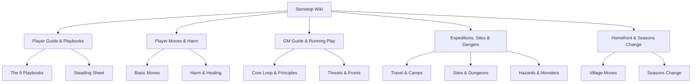

# 🏔️ Stonetop Compendium

> *"This village, Stonetop—it’s our home. It’s not a glamorous place. Far from it. But we look out for each other. Everyone contributes. Everyone shares. And right now, trouble is a-brewing."*

Welcome to the **Stonetop Navigable Wiki**, an interactive, hyperlinked compendium of **Stonetop Book I** (by Jeremy Strandberg). Stonetop is a tabletop roleplaying game of **hearth fantasy** powered by the Apocalypse engine, focusing on community survival, expeditionary mystery, and the weight of leadership in an isolated iron-age frontier.

---

## 🧭 Quick Navigation Directory

---

## 📚 Table of Contents by Section

### 1. Foundation & First Steps
* [**01. Welcome to Stonetop & The Setting**](01_welcome_and_setting.md) — Hearth fantasy, the world, cultural expectations, and tone.
* [**02. Getting Started & First Session**](02_getting_started.md) — Setting up the table, tone & safety, character creation, and the first spring.
* [**03. Playing the Game & Core Rules**](03_playing_the_game.md) — The conversation, player agenda, flow of play, dice & moves, principles, and gear.

### 2. Character Playbooks
* [**Playbooks Directory & Overview**](playbooks/index.md) — Complete selection guide and playbook rules.
  * [**The Blessed**](playbooks/the_blessed.md) — Consecrated vessel of Danu, goddess of crops, spring, and the soil.
  * [**The Fox**](playbooks/the_fox.md) — Cunning problem solver, dirty fighter, and sharp survivor.
  * [**The Heavy**](playbooks/the_heavy.md) — The village champion, scarred veteran, sheriff, or storm-marked warrior.
  * [**The Judge**](playbooks/the_judge.md) — Arbiter of Aratis, upholder of ancient law, wielder of the holy hammer/helm.
  * [**The Lightbearer**](playbooks/the_lightbearer.md) — Fiery priest of Helior the Sun, bringer of radiant light and truth.
  * [**The Marshal**](playbooks/the_marshal.md) — Leader of the village militia, commander of a loyal crew, master tactician.
  * [**The Ranger**](playbooks/the_ranger.md) — Scout of the Great Wood, beast-bonded hunter, tracker of the wild.
  * [**The Seeker**](playbooks/the_seeker.md) — Scholar of Things Below, tamperer with arcana, delver into Maker ruins.
  * [**The Would-be Hero**](playbooks/the_would_be_hero.md) — Eager youth marked by destiny, burning brightly to save the village.
  * [**Playbook Inserts & Special Moves**](playbooks/inserts.md) — Inventory, animal companions, crew, initiates, invocations, and special playbooks.
  * [**The Steading Playbook**](playbooks/steading_playbook.md) — The communal village character sheet: Prosperity, Defenses, Population, and Improvements.

### 3. The Rules Engine
* [**04. Running the Game (GM Guide)**](04_running_the_game.md) — The GM agenda, core conversation loop, spotlight, GM moves, and preparation.
* [**05. Player Moves & Basic Moves**](05_player_moves.md) — Complete text of Defy Danger, Clash, Defend, Know Things, Let Fly, Persuade, Seek Insight, Burn Brightly, and Death's Door.
* [**06. Harm, Wounds & Healing**](06_harm_and_healing.md) — HP, damage, debilities, problematic wounds, recovery, and death.

### 4. Adventures, Expeditions & Dangers
* [**07. The First Adventure**](07_first_adventure.md) — Goals, structure, setup questions, framing scenes, and launching the campaign.
* [**08. Threats & Fronts**](08_threats.md) — Threat design, instincts, countdown clocks, stakes, and updating threats.
* [**09. Expeditions & Travel**](09_expeditions.md) — Route planning, journey moves, foraging, navigating the wild, making camp, and returning home.
* [**10. Sites & Dungeons**](10_sites.md) — Environmental storytelling, site exploration, site creation, and *The Green Lord's Tomb*.
* [**11. Dangers, Hazards & Monsters**](11_dangers.md) — Environmental hazards, monster stat blocks, running combat, and creature moves.
* [**12. Discoveries, Artifacts & Arcana**](12_discoveries.md) — Clues, sites, encounters, Maker relics, and strange arcana.

### 5. Community & Ongoing Play
* [**13. NPCs & Followers**](13_npcs_and_followers.md) — Creating NPCs, follower moves, quality, loyalty, and recruitment.
* [**14. The Homefront & Seasons Change**](14_homefront.md) — Bringing the village to life, aftermath, homefront moves, and the Seasons Change procedure.
* [**15. Writing Moves & Love Letters**](15_writing_moves.md) — Designing custom moves, triggers, choices, and customized love letters.
* [**16. The Ongoing Campaign & Advancement**](16_the_game_ongoing.md) — Session rhythm, advancement, retiring characters, time skips, and campaign climaxes.
* [**17. Reference & Master Index**](17_reference_and_index.md) — Acknowledgements, mediography, and master alphabetical index.

---

## ⚡ Core Moves Quick Reference

| Move | Trigger | Roll | Key Outcome |
| :--- | :--- | :--- | :--- |
| **Defy Danger** | When you act despite imminent peril | +Appropriate Stat | 10+: You succeed; 7–9: You stumble or face a hard choice |
| **Clash** | When you trade blows in close combat | +STR (or +DEX) | 10+: Deal your damage, avoid theirs; 7–9: Trade damage |
| **Defend** | When you stand firm against attack | +CON (or +WIS) | Hold 1–3 hold to absorb damage, protect allies, or strike back |
| **Let Fly** | When you attack a target at range | +DEX | 10+: Full damage; 7–9: Pick an obstacle, ammo loss, or weak hit |
| **Know Things** | When you consult your accumulated lore | +INT | 10+: Truthful, actionable facts; 7–9: Vague or concerning truth |
| **Seek Insight** | When you carefully study a person or situation | +WIS | Ask 1–3 questions from the list; take +1 forward when acting on it |
| **Persuade** | When you press, bribe, or cajole an NPC | +CHA | 10+: They do it or reveal what it takes; 7–9: They demand reassurance |
